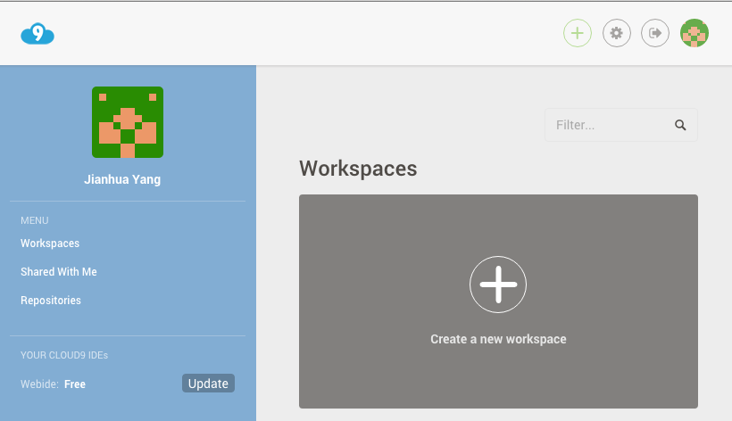
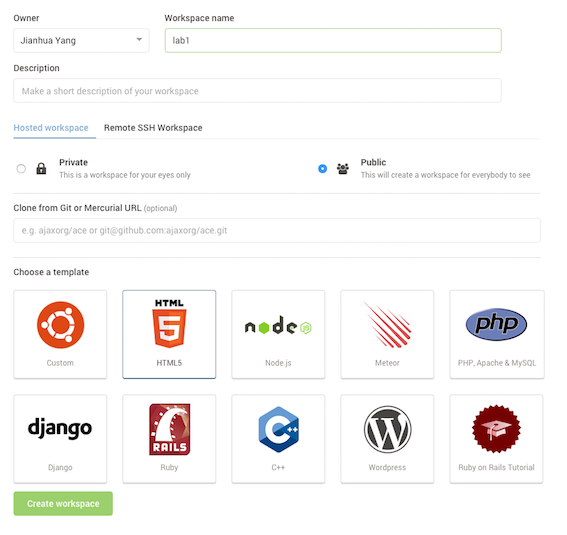
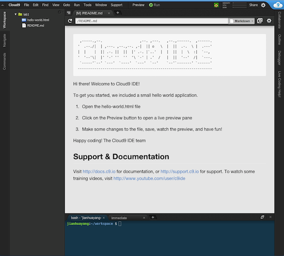
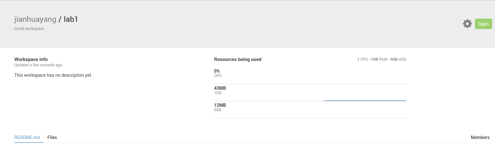
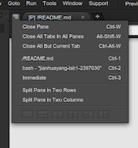
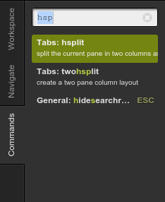
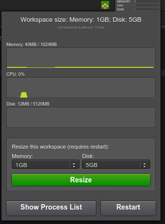
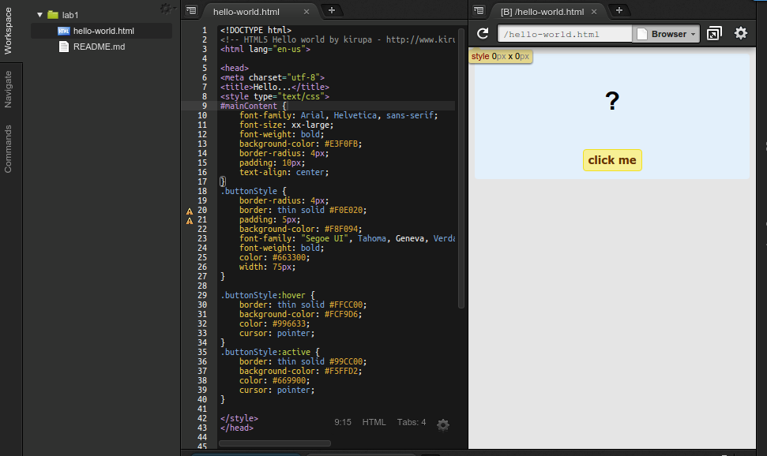
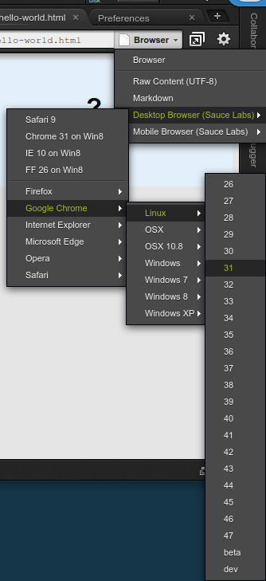
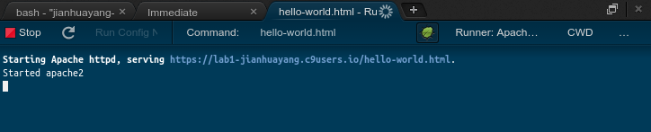

# The Cloud9 IDE

Nowadays everything is on the cloud. This includes your integrated development environment (IDE). In this module we'll use [Cloud9](https://c9.io/) as our platform to learn web development. Compared with traditional IDEs such as [Aptana Studio](http://www.aptana.com/) cloud-based tools such as C9 offers the following advantages, among many others:

* Minimized maintenance efforts.
* Better access your code, virtually from everywhere.
* Easier to share and collaborate.

> As a programmer we don't normally share photos like most others do, we share codes instead. This is because [talk is cheap, show me the code](https://en.wikipedia.org/wiki/Linus_Torvalds).

But the drawback is obvious -- you need to be connected. So my advice is KEEP BACKING UP!

## Setting up C9

### Create (and delete) a workspace

Visit https://c9.io and create an account if you haven't got one. After signing in you should see something similar to this



This is called the Dashboard, and it's where different workspaces (projects) are being managed. Click on the plus sign to create a new workspace and name it lab1. Select HTML5 as the template and click Create workspace



This will bring you to something similar to below



Congratulations! You've just created your first project in C9! Notice the littller cloud icon to the right hand side of the IDE, click on it will bring you back to the Dashborad.


What you'll see now is that a new workspace called lab1 appeared in your Dashborad. Click anywhere within lab1's rectangle frame, but not the Open button, this is take you to the Workspace overview page



This is where you can find out how much diskspace and RAM are being used in your project, and what files you have etc. If you exceed the limit for a free acount, you'll have to pay!

Click on the little green gear icon will take you to the settings page, this is where the whole project can be deleted (for ever). So be careful with this.


Now click on the green Open icon to go back to the IDE itself.

### C9 guided tour

The IDE can be roughly devided into 4 areas:

1. The horizontal menu bar.
2. The left/right tools window.
3. The main editor window in the middle.
4. The Console window at the bottom.

The visibility of these winodws can be toggled using View dropdown menu. 

There're two useful fucntions you need to know:

1. Press F6 to toggle the Console window. If you think the Console is useless (it's not) you can hide it by pressing F6. For a full list of keyboard shortcuts, click [here](https://docs.c9.io/docs/keybindings).
2. The editor screen can be split, either horizontally or vertically, by clicking View ==> Layout ==> Split. As an alternative, you can click the small 'right click' icon to the top left corner of the editor window.




By default the Workspace tool window is open to the left. This is where you create and rename files/folders. It also supports right click etc. Drag and drop is also possible, but only within the workspace and not between C9 and your computer (at least not on free accounts).


Now click on the Commands tool window to bring it up. This Commands tool windows provides many useful commands (shortcuts) to everyday operations. For example, in the textbox type in hsplit and hit enter. Now you see the editor window split again. 



To the right hand side of the menu bar, you see the 'Share' and configure icons. This is where you share your code with me to get help if you get stuck one day (please don't). There's also an overview of how much CPU/disk space etc. are being used. This allows you to monitor your virtual machine (we'll come back to that later).



### Preview your website

Traditionally if you want to build a website and see how other people see it, you'll need to install different versions of browsers. Now with technologies like C9, we can save time in setting up things like broswers on your own computer.

Double click the automatically generated file hello-world.html to view it in the editor. Don't worry about the actual code. Now right click that file in Workspace tool window and select Preview. What you'll see is the file is being rendered in a browser window.



Click on the Browser button to switch to a different browser to see what your webpage looks like in a different browser.



Right click on file hello-world.html and select Run. This will open a new Console window similar to the one below:



Copy that url and paste into the browser window, now you'll see the same content as before. The URL for my webpage is at

```java
    https://lab1-jianhuayang.c9users.io/hello-world.html
```

We have now used two ways to view an html file:

1. Preview shows you what your webpage looks like in a static manner. That is the same as you open an html file using your browserss File ==> Open.. senario.
2. Run determines what you have in the html first of all (and execute if necessary), and then serve it through a web server. If you website work with data, as we'll do later in the module, you'll need to run it through a web server.

> For more info on webpages and webiste, click this link from Mozilla [Webpages, websites, web servers, and search engines](https://developer.mozilla.org/en-US/Learn/Pages_sites_servers_and_search_engines).

## Basic Linux commands

pipes, output

### Navigating the filesystem

### Handling files

### File permissions

## What if C9 is down?

### Work locally using Brackets

### Setting up webservers using XAMPP or Ubuntu


