# The Codeanywhere IDE

Nowadays everything is on the cloud. This includes your integrated development environment (IDE). In this module, we'll use [Codeanywhere](https://codeanywhere.com) as our platform to learn web development. Compared with traditional IDEs such as [Aptana Studio](http://www.aptana.com/) cloud-based tools such as C9 offers the following advantages, among many others:

* Minimized maintenance efforts.
* Better access your code, virtually from everywhere.
* Easier to share and collaborate.

> As a programmer we don't normally share photos like most others do, we share code instead. This is because, as said by [Linus Torvalds](https://en.wikipedia.org/wiki/Linus_Torvalds), 'talk is cheap, show me the code'.

But the drawback is obvious -- you need to be connected. So my advice is KEEP BACKING UP!

## Setting up Codeanywhere

### Create (and delete) a workspace

Visit https://codeanywhere.com and create an account if you haven't got one. After signing in you should see something similar to this. The difference will be that you won't already have a project.

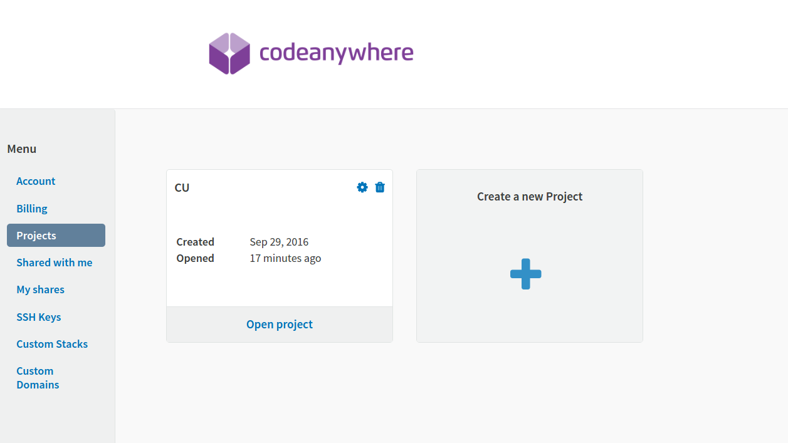

This is called the Dashboard, and it's where different workspaces (projects) are being managed. Click on the plus sign in the big grey square to create a new _project_ and name it `CU`. Now you can click on the **Open Project** link where you will be asked to add a **container**. Scroll down and select the _HTML container running on Ubuntu_ and name it `205CDE` as shown in the screenshot below.

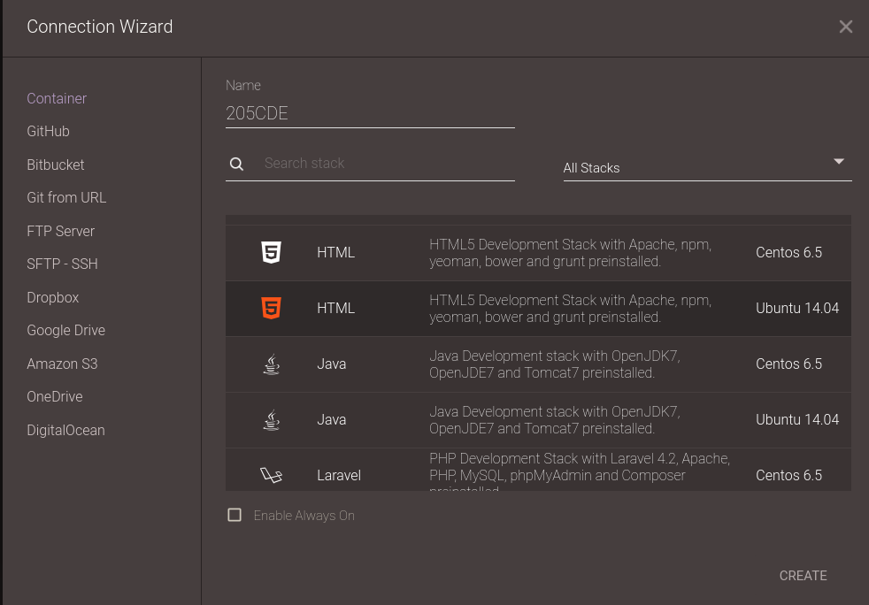

As soon as this has been completed, the container will open and you will see the IDE. Our first task is to open the **SSH Terminal** by right-clicking on the **205CDE** container and choosing the first option from the context menu. This will allow us to run bash commands directly in Codeanywhere.


### Cloning the Lab Materials

You will be working on the lab exercises using the Codeanywhere IDE so the next step is to locate the materials on the University GitHub server and clone these into your IDE.

Start by logging into https://github.coventry.ac.uk using your University username and password. Once you are logged in, access your profile screen using the menu option shown below.

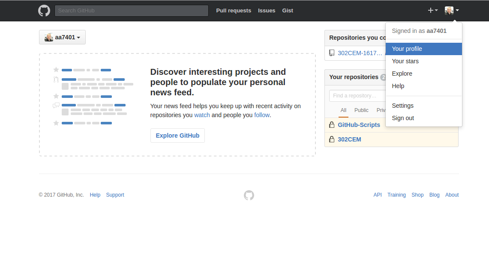

On the profile screen, upload a _head and shoulders_ photo of yourself.

Check the exact **name** and **email address** associated with your account, this will come from the University's active directory system. make a note of this for later.

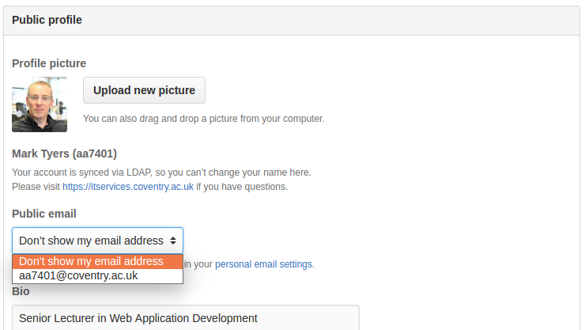

Now you will need to switch to the 205CDE organisation as shown.

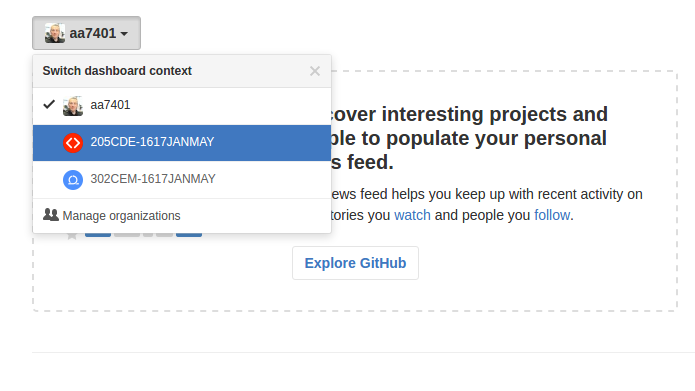

To see the repositories in the organisation you need to click on the View organisation button in the top-right of the screen as shown.

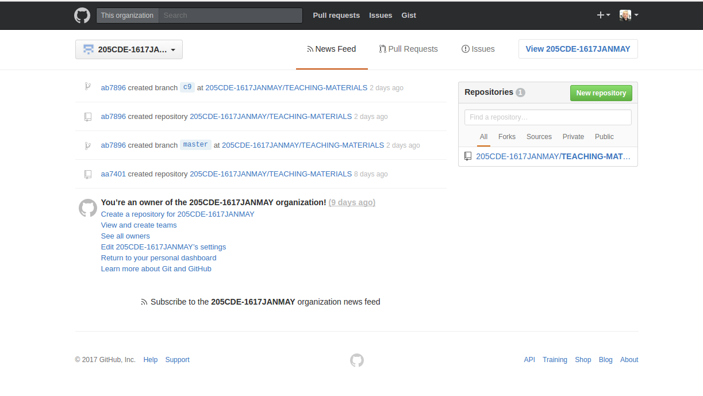

As you can see there is a repository called `TEACHING-MATERIALS` which contains all the lab materials you will need in this module. Click on this repository title to see the contents.

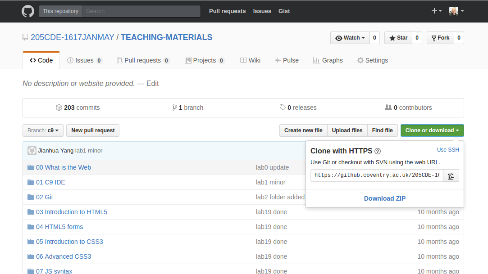

Click on the green **Clone or Download** button and use the clipboard icon to copy the url into the computer clipboard. Now we can use the SSH Terminal in Codeanywhere to clone these materials into our IDE. Note the period (full-stop) at the end. This clones the repository into the _current directory_ instead of creating a new directory under it.
```
$ git clone -o upstream https://github.coventry.ac.uk/205CDE-1617JANMAY/TEACHING-MATERIALS.git .
```
After a few minutes the cloning will be complete. You will need to refresh the file tree in Codeanywhere by right-clicking on the `205CDE` container name and choosing _refresh_ from the context menu.

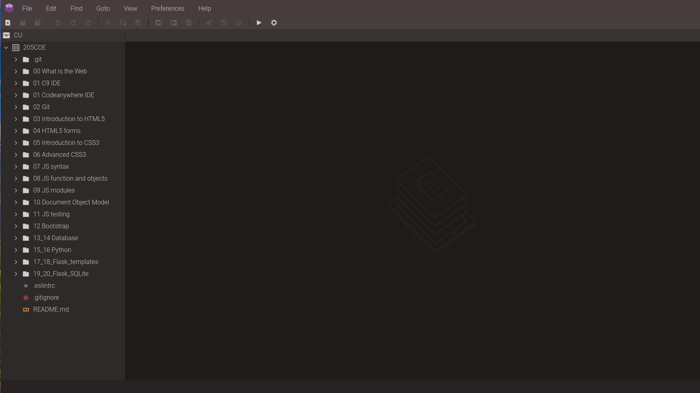

### Updating the Git Profile

Remember earlier where we identified the name and email address assigned to our University GitHub profile. Now we need to update the Git profile on Codeanywhere to match these settings. In the SSH Terminal enter the following commands, substituting your own name and email address as they appear in your GitHub profile. First we check the current values and change them only if needed.
```
git config user.name
git config user.name "Mark Tyers"
git config user.name
git config user.email
git config user.email "aa7401@coventry.ac.uk"
git config user.email
```

### Adding a New Remote Repository

As we work through the lab exercises, making changes to our code we will need to ensure this is backed up. The _TEACHING-MATERIALS_ repository is not writable (for obvious reasons) so we will need to add a new remote. Make sure you are in the 205CDE organisation on GitHub then click on the green **New repository** button.

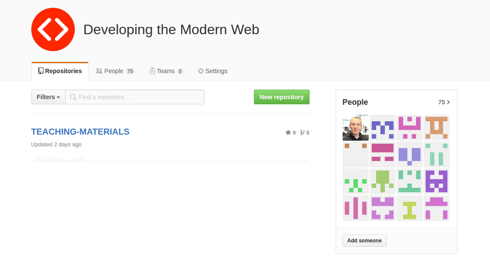

We can now create our own _private_ repository called `worksheets` as shown. Click on the **Create repository** button when done.

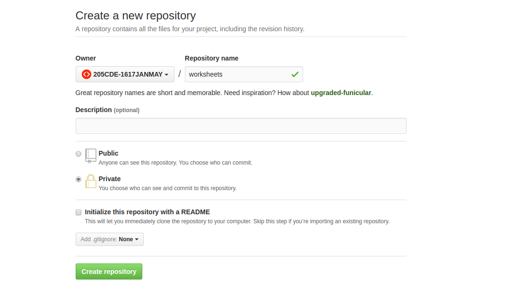

Let's use the _Quick Setup_ option by clicking on the small clipboard icon to copy our repository URL to the clipboard.

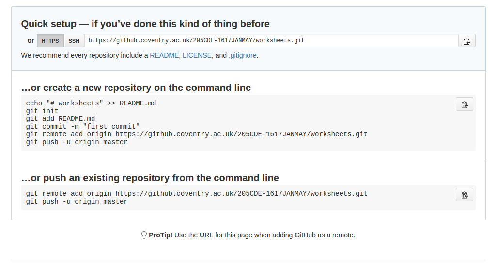

Now we can add this as a second remote called `origin` by entering the following in the SSH Terminal in Codeanywhere, substituting the URL in the clipboard where shown. Once this is completed we can list the remotes we have added and finally push all the commits to our new remote.
```
$ git remote add origin <URL>
$ git remote -v
$ git push origin --all
```
If we refresh the GitHub webpage for our new repository we should see an exact copy of the original one.

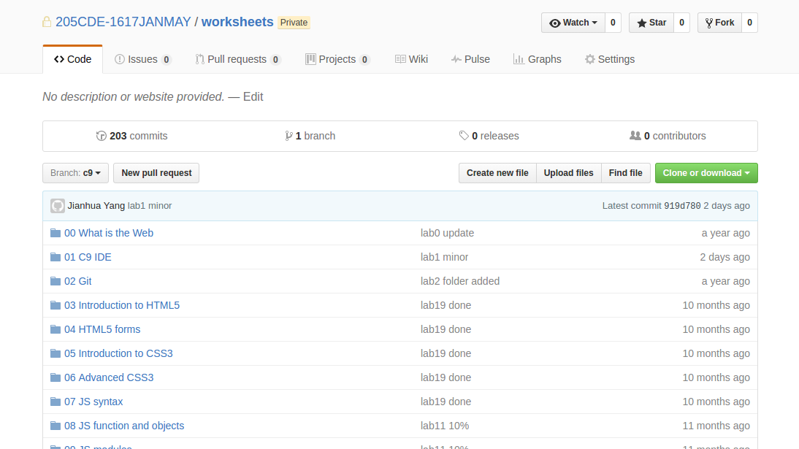

### Cacheing Git Credentials

You have probably noticed that to push to your remote repository you needed to enter your username and password. For a one-off this is not an issue but with our current settings this will have to be entered every time you push which can get annoying. To make things easier you can set up a _credential cache_ which will cache your username and password. The timeout is the number of seconds to cache the credentials for. In this example they will be cached for an hour.
```
git config --global credential.helper 'cache --timeout=3600'
```

### Previewing a Web Page

Since the IDE is cloud-based we can use the built-in Apache web server to view our web pages through an online URL. Let's have a go at this. Start by navigating to the Codeanywhere directory, right-clicking on the `index.html` file and choosing **Preview** from the context menu.


This will open the web page in a new browser tab. Notice the URL. What happens when you click on the button?

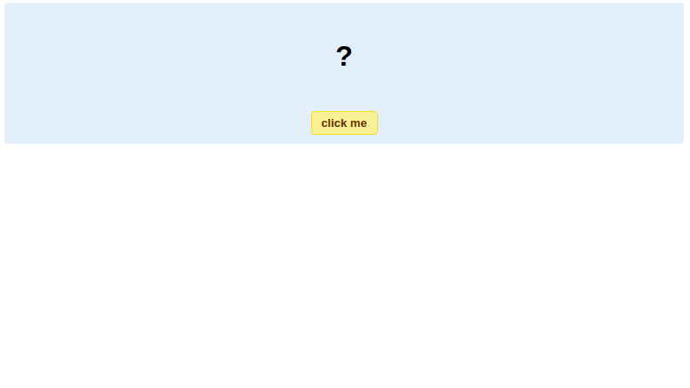

## Basic Linux Commands

Behind the scene, Codeanywhere is based on Linux technology and specifically it's Ubuntu 14.04 at the time of writing (Jan 2017). This can be verified if you issue the following command in the terminal window:

```sh
$ lsb_release -a
No LSB modules are available.
Distributor ID: Ubuntu
Description:    Ubuntu 14.04 LTS
Release:        14.04
Codename:       trusty 
```
Basically, what happens when you create a Workspace in Codeanywhere the system creates a virtual machine for you using Ubuntu 14.04 with the configuration of 5GB disks etc. You need to know some basic command line operations if you work with Codeanywhere or web technologies in general.

> Other popular Linux OSs include Fedora and openSUSE. For a comprehensive list, read [Put the fun back into computing from Distrowatch.com](http://distrowatch.com).

### Navigate the filesystem

The Console window (also called terminal or shell) is a way we interact with the virtual machine that hosts our workspace. And probably it's the most effective way. 

> They say that [Jeff Dean](https://en.wikipedia.org/wiki/Jeff_Dean_(computer_scientist)) uses just two keys '0' and '1' to talk to the console, which is probably not true. [Read more from Quora.com](https://www.quora.com/What-are-all-the-Jeff-Dean-facts).
>

Use the following command to see where you are in the system (pwd = print working directory)

```sh
$ pwd
/home/cabox/workspace
```
To see what files we have here

```sh
$ ls
00 What is the Web          09 JS modules
01 C9 IDE                   10 Document Object Model
01 Codeanywhere IDE         11 JS testing
02 Git                      12 Bootstrap
03 Introduction to HTML5    13_14 Database
04 HTML5 forms              15_16 Python
05 Introduction to CSS3     17_18_Flask_templates
06 Advanced CSS3            19_20_Flask_SQLite
07 JS syntax                README.md
08 JS function and objects
```

The `ls` command can have different options in the form `ls -a -l` or `ls -al`. Here option `-a` tells the system to show hidden files/folders, and `-l` is the flag for the long listing format. In the outputs, the single dot `.` represent the current directory and the double dot `..` represents the parent directory. Names that begin with a period `.` are hidden files/folders, which don’t normally show up. 

```sh
$ ls -al
total 100                                                                
drwxrwxr-x 21 cabox cabox 4096 Jan 15 11:03 .
drwxr-xr-x 11 cabox cabox 4096 Jan 15 10:38 ..
-rw-r--r--  1 cabox cabox  350 Jan 15 10:21 .eslintrc
drwxr-xr-x  8 cabox cabox 4096 Jan 15 12:41 .git
-rw-r--r--  1 cabox cabox 1132 Jan 15 10:21 .gitignore
drwxr-xr-x  2 cabox cabox 4096 Jan 15 10:21 00 What is the Web
drwxr-xr-x  4 cabox cabox 4096 Jan 15 10:21 01 C9 IDE
drwxr-xr-x  3 cabox cabox 4096 Jan 15 12:50 01 Codeanywhere IDE
drwxr-xr-x  4 cabox cabox 4096 Jan 15 10:21 02 Git
drwxr-xr-x  4 cabox cabox 4096 Jan 15 10:21 03 Introduction to HTML5
drwxr-xr-x  4 cabox cabox 4096 Jan 15 10:21 04 HTML5 forms
drwxr-xr-x  4 cabox cabox 4096 Jan 15 10:21 05 Introduction to CSS3
drwxr-xr-x  4 cabox cabox 4096 Jan 15 10:21 06 Advanced CSS3
drwxr-xr-x  4 cabox cabox 4096 Jan 15 10:21 07 JS syntax
drwxr-xr-x  3 cabox cabox 4096 Jan 15 10:21 08 JS function and objects
drwxr-xr-x  3 cabox cabox 4096 Jan 15 10:21 09 JS modules
drwxr-xr-x  3 cabox cabox 4096 Jan 15 10:21 10 Document Object Model
drwxr-xr-x  4 cabox cabox 4096 Jan 15 10:21 11 JS testing
drwxr-xr-x  4 cabox cabox 4096 Jan 15 10:21 12 Bootstrap
drwxr-xr-x  4 cabox cabox 4096 Jan 15 10:21 13_14 Database
drwxr-xr-x  4 cabox cabox 4096 Jan 15 10:21 15_16 Python
drwxr-xr-x  4 cabox cabox 4096 Jan 15 10:21 17_18_Flask_templates
drwxr-xr-x  4 cabox cabox 4096 Jan 15 10:21 19_20_Flask_SQLite
-rw-r--r--  1 cabox cabox 5508 Jan 15 10:21 README.md
```

Use the following command to navigate to the `01 Codeanywhere IDE` folder and see what's in there. Notice that all spaces need to be _escaped_ by preceeding them with a forward-slash (\) character.

```sh
$ cd 01\ Codeanywhere\ IDE/
$ ls -a -l
total 36
drwxr-xr-x  3 cabox cabox  4096 Jan 15 12:50 .
drwxrwxr-x 21 cabox cabox  4096 Jan 15 11:03 ..
drwxr-xr-x  2 cabox cabox  4096 Jan 15 12:56 .md_images
-rw-r--r--  1 cabox cabox 16932 Jan 15 13:02 README.md
-rw-r--r--  1 cabox cabox  1272 Jan 15 12:50 index.html 
```

> By default, the command prompt changes if you change the current directory.

Use the following command to navigate to the root of the file system

```sh
$ cd /
$ pwd
/
```

Now we're at the root of the file system. If you issue `ls` command again you'll see different folders in the system

```sh
    $ ls
bin   dev  fastboot  lib    media  opt   root  sbin  sys  usr
boot  etc  home      lib64  mnt    proc  run   srv   tmp  var
```
> The system arranges so that the display goes vertical first and then horizontal.

Things are getting interesting from here. All these folders are for different purposes. Here list a few important ones, for a complete list [read a blog article written by Peter Upfold](https://peter.upfold.org.uk/blog/2006/07/18/a-guide-to-files-and-folders-on-linux/)

* bin is for binaries, in other words, programmes, executables.
* etc is for configuration files e.g. Apache configuration.
* home is where your personal stuff goes e.g. workspace.
* var is for application data such as SQL database.

Since we have Apache server installed, if we do the following we'll see how different parts of a single package are separated into different folders

```sh
$ dpkg -L apache2
/.
/usr
/usr/share
......
/etc/apache2/sites-available/default-ssl.conf
/etc/init.d
/etc/init.d/apache2
/etc/ufw
/etc/ufw/applications.d
......
/var/log/apache2
/var/www
/var/www/html
/var/cache
......
```

### Handle files and permissions

Regarding file operations you need to know how to create, copy, rename, and delete. The Linux commands corresponding to these are `touch`, `cp`, `mv`, and `rm`.

Copy the Apache server configuration file to your local directory

```sh
$ cd ~/workspace/
$ cp /etc/apache2/apache2.conf apache2.conf
```
Now you'll see that you have a new file named apache2.conf in your workspace. You can now double click to edit in the IDE.

The following commands will create a new file and then delete it.

```sh
$ cp apache2.conf apache2.conf_new
$ ls
apache2.conf  apache2.conf_new
$ rm apache2.conf_new 
$ ls
apache2.conf
```

Now issue the following commands and see the differences in the outputs

```sh
$ ls -l /etc/apache2/apache2.conf
    -rw-r--r-- 1 root root 7115 Jan  7  2014 /etc/apache2/apache2.conf
$ ls -l apache2.conf
-rw-r--r-- 1 ubuntu ubuntu 7115 Jan 14 00:18 apache2.conf
$ id
uid=1000(ubuntu) gid=1000(ubuntu) groups=1000(ubuntu),27(sudo),1001(rvm)
```

Unlike Windows, files and folders in Linux have owners and permissions. (Windows do too, but not in an obvious way). You can see even though we copied the file from a system folder (and everything should be exactly the same), the owner has been changed.

For both files, the permissions are `-rw-r--r--`. This means that for the three positions in the order of the owner, group, others, the permissions are read/write `rw`, read only `r` and read only `r`. But the owner has been changed from root to ubuntu.

The command `id` tells us that the current user (*you*, that is) has been assigned a username `cabox`.

Run the following commands to change some permissions of the file

```sh
    $ chmod go-r apache2.conf
    $ ls -l apache2.conf
    -rw------- 1 cabox cabox 7115 Jan 14 00:18 apache2.conf
    $ chmod u+x apache2.conf
    $ ls -l apache2.conf
    -rwx------ 1 cabox cabox 7115 Jan 14 00:18 apache2.conf*
```

Now that the read `r` permission has been removed from group `g` and others `o`, and execution has been added to the owner.

> A shortcut to the example above is to use the number system `chmod 700 apache2.conf`. [Read more explanation and examples on Linux file permissions from Linux.com](https://www.linux.com/learn/tutorials/309527-understanding-linux-file-permissions).

## What if Codeanywhere is down?

OK, this is unlikely. But if you are a worrier (like myself) you always want a plan B. Then this is what you need to follow. Note that this will allow you to edit the code you have committed and pushed to your remote. Any code not pushed won't be available until Codeanywhere is back up and running.

### Work Locally

If you plan on working locally you will need to have a modern code editor installed. My personal choice is Microsoft's Visual Studio Code which is a free download for Linux, Mac and Windows computers.

Launch Visual Studio Code and open the Integrated Terminal from the View menu.

Navigate to your documents directory then run the git clone command on your project on the GitHub server. This will give you a local copy of your repository code to work on.
    
Now you're ready to start editing.

## Advanced: set up local web servers

Brackets enables you to edit and preview HTML files locally. But you'll need to setup a web server to view dynamic contents. You don't need it right now, but you'll need it later during the module.

Unfortunately, the university policy doesn't allow you to install any software on ITS machines yourself, so you'll have to do it on your own machines. But it's important you install and configure a web server yourself.

Follow instructions below to install a web server yourself:

1. Install Ubuntu:
    
    Depending on if you use the Chromebook regularly (comfortable) or not, you have two options:
    * Option 1: Open your Chromebook, follow instructions given [here](http://lifehacker.com/how-to-install-linux-on-a-chromebook-and-unlock-its-ful-509039343) to install Ubuntu on a Chromebook.
    * Option 2: Open your Windows machine, install [VirtualBox](https://www.virtualbox.org) and then install [Ubuntu](http://www.ubuntu.com) within it. A step by step instruction can be found on [wikiHow](http://www.wikihow.com/Install-Ubuntu-on-VirtualBox).
    
2. Boot into Ubuntu to install LAMP server. In the example below I use Ubuntu installed on a VirtualBox running on a Mac. But if it's Chromebook or Windows it's essentially the same.
    
    ```sh
        sudo apt-get update
        sudo apt-get install lamp-server^
    ```
    
    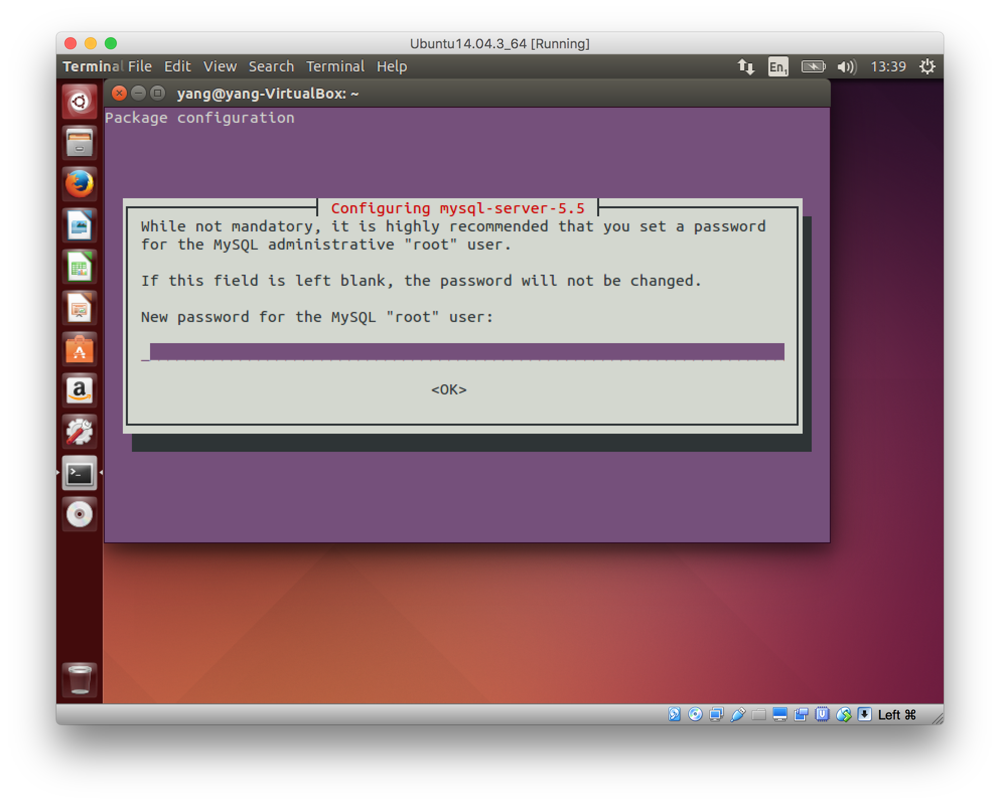
    
    > [The official Ubuntu documentation on installing LAMP](https://help.ubuntu.com/community/ApacheMySQLPHP)
    
3. Now you can put your lab1 stuff in this server and view it in a browser.
    
    * Download your lab1 material and extract within Ubuntu. For example, mine is extracted at `/home/yang/Downloads/workspace`
    
    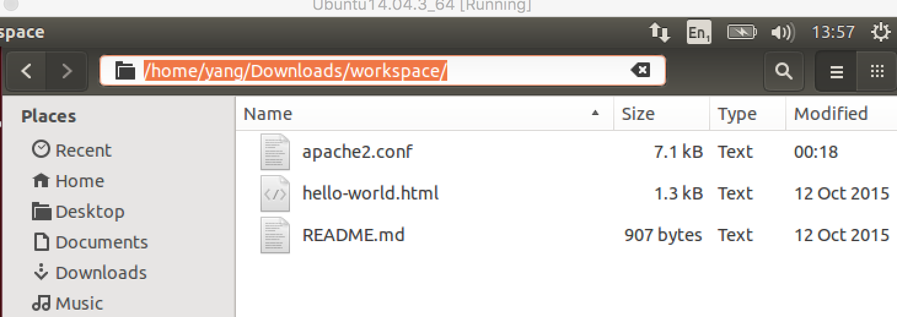
    
    * Open terminal, create a symbolic link to `/var/www/HTML`. A symbolic link basically is a pointer that stays inside `/var/www/HTML` but pointing to the actual location of our lab material.
    
    ```sh
        sudo ln -s /home/yang/Downloads/workspace/ /var/www/html
    ```
    
    * Restart Apache server. This step may not be necessary, just a precaution.
    
    ```sh
         sudo /etc/init.d/apache2 restart
    ```
    
    * You can now open a browser and view the file on your local server
    
    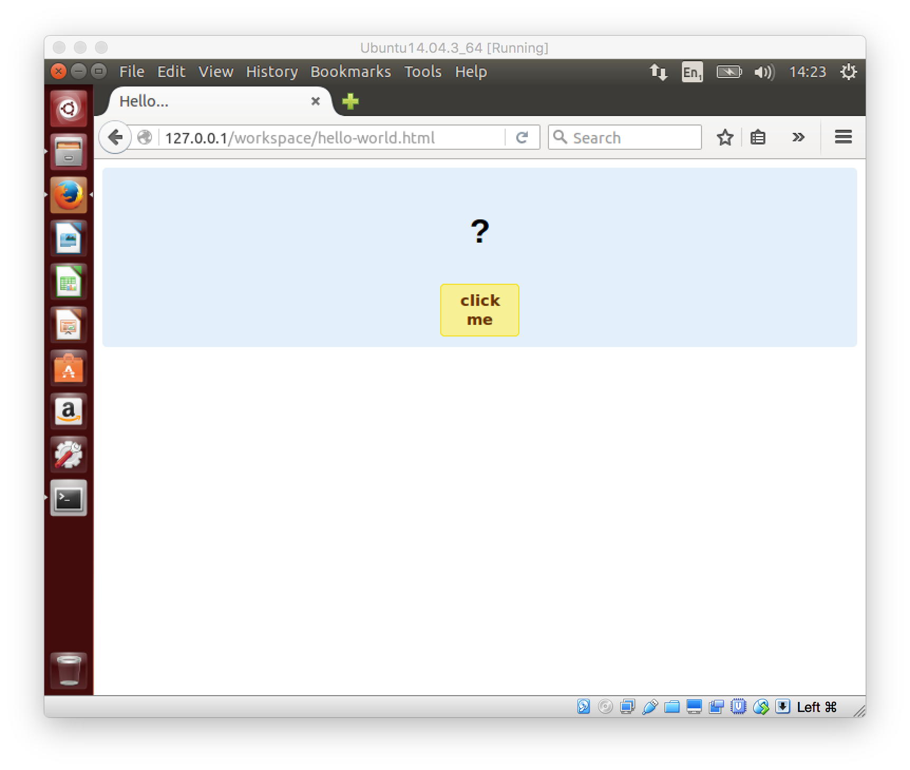

4. You have seen previously files installed by in Apache package using `dpkg -L apache2`. Now let's have a little look to understand how to configure Apache. Open the apache2.conf file in C9 or Ubuntu. Have a read through, especially the following block. This refers to the folder we used before. For explanations of these options, refer to the [official Apache documentation](http://httpd.apache.org/docs/2.4/mod/core.html).
    
    > [Official Ubuntu Apache2 Web Server guide](https://help.ubuntu.com/lts/serverguide/httpd.html)
    
    ```xml
    <Directory /var/www/>
        Options Indexes FollowSymLinks
        AllowOverride None
        Require all granted
    </Directory>
    ```
    

> There are quite a few LAMPP or WAMP packages available, some are listed here on [WiKi](https://en.wikipedia.org/wiki/List_of_Apache%E2%80%93MySQL%E2%80%93PHP_packages). Among these my favorites are [XAMPP](https://www.apachefriends.org/index.html) on Windows and [MAMP](https://www.mamp.info/en/) on Mac.


