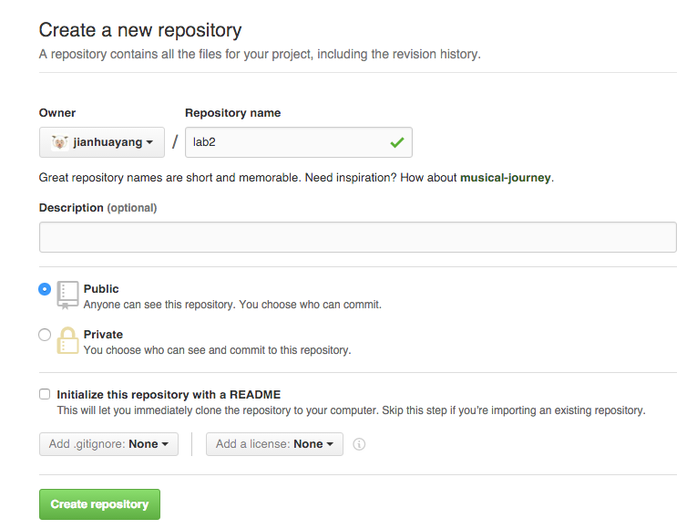
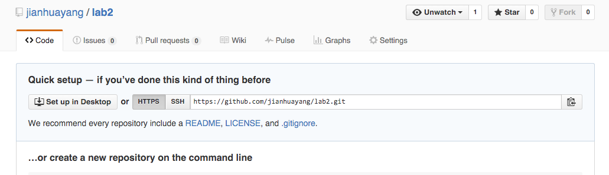
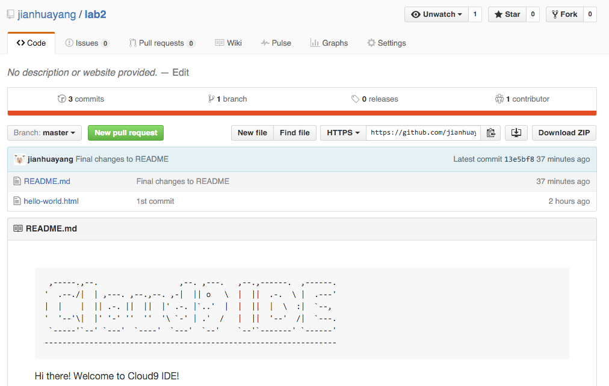

# Git

Git is a sidely-used version control system (VCS), and probably the most popular one. You need Git mainly for three reasons:

1. The source code of your website forms part of your final assessment. This needs to be submitted through GitHub, which is a website based on Git.
2. Git allows you to easier backup (and restore) your source code.
3. Git allows easier sharing and collobration.

You'll see details of these as you go along.

> If you are old enough you've probably heard of [Google Code Search](http://web.archive.org/web/20101112131244/http://www.google.com//codesearch), which is a tool that allows programmers to search for source code. Partially due to the increased popularity of Git-base code hosting websits such as Github, this tool has now been shut down. ([code.google.com](code.google.com) is not the original site anymore.)

## Work with Git locally

In C9 create a new workspace based on HTML template and name it lab2. In terminal type in the following command and press enter. This shows you Git has been installed

```sh
    $ git
    usage: git 
    ......
    The most commonly used git commands are:
       add        Add file contents to the index
       bisect     Find by binary search the change that introduced a bug
    ......
```

> C9 Ubuntu virtual machine has Git installed by default. If you work on your own computers, make sure you download and install [Git](https://git-scm.com/downloads) first.

Here we are presented with a summary of the available Git commands.

### Initialise the repository

In terminal issue the following command to initialise a Git repository.

```sh
    $ git init
    Initialized empty Git repository in /home/ubuntu/workspace/.git/
```

A Git repository contains a hidden directory called .git which contains all the tracking data. We need to check that there is a repository. Obviously we can't see it in the file tree (its hidden) so we need to run a command to list all the files, including the hidden ones (`ls` lists the files whilst the `ls -a` flag includes the hidden ones.

```sh
    $ ls -a
    ./  ../  .c9/  .git/  README.md*  hello-world.html
```

The first file (.) represents the current directory, the second (..) the parent directory and the last (.git) is the Git repository. So in this case we can see that there is now a repository.

### Set user information

The first time you use the repository you should check that the name and email details are correct. These are used to indicate who has been committing code. Start by displaying the current contents of the git config file:

```
    $ git config --list
    user.name=Jianhua Yang
    user.email=(blur blur blur, you all know it)
    ......
```

You are looking for a single entry for user.name and one for user.email. So if yours are like mine, you're fine.

There may be additional keys and values stored. If there are multiple names and/or emails you can replace all instances using the following two commands (substituting your own name and email)
```
git config --global --replace-all user.email "johndoe@gmail.com"
git config --global --replace-all user.name "John Doe"
```

> Ever wonder why it's John again, click [here](https://git-scm.com/book/en/v2/Getting-Started-First-Time-Git-Setup).

### Stage files

At any stage you can use the `status` command to check the status of the project files. Try running this now:

```sh
    $ git status
```

You will see a message that there are untracked files. These are listed in red. Before committing files they need to be placed in the staging area using the `add` command

> You only need to type the first few letters of the filename, press the tab key to auto-complete.

```sh
    $ git add .
```

Here `.` means the current directory.

So how can we check the file has been staged? Remember that status command?

```sh
    $ git status
```

You will see that the files have been added to the staging area to create a snapshot.

### Commit files

Once we have added one or more files to the staging area and created a snapshot we can commit the changes to our local repository. Each snapshot is accompanied by a message to explain what changes have been made. Before making the commit it can be useful to see what changes you will be committing.

```sh
    $ git diff --cached
    diff --git a/README.md b/README.md
    new file mode 100755
    index 0000000..064ecaa
    --- /dev/null
    +++ b/README.md
    @@ -0,0 +1,26 @@
    ......
```

You'll be automatically redirect to a command line text editor. Type letter 'q' at the command prompt and hit enter to get out of it. Use your mouse to scroll up and down in the terminal window. Take a moment to make sense of the results. The three + characters next to the filename indicate that three lines have been changed. Then all the modified lines are listed. A + character at the start of the line indicates the line has been added, a - character indicates the line has been deleted. So we can see that since we haven't committed, all lines are new.

Now lets commit our changes. Remember that you need to include a descriptive message with every commit.

```sh
    $ git commit -m '1st commit'
```

This commits the changes in your staged files to the repository and removes all the files from the staged area. We can check this using the status command:

```sh
    $ git status
```

You get two important pieces of information:

1. nothing to commit (there are no changes to stage)
2. working directory clean (there are no staged files)

Lets take a look at the commit history. This lists all the commits you have made to the Git repository.

```sh
    $ git log
```

### A second commit

Return to C9 and open README.md in the editor. At the very bottom of the file add today's date

```sh
    20 Jan 2016
```

> You don't have to add the date, this is just to make some changes to the file.


Run the status command `git status` to show the current status of the repository. You should see that the README.md file is shown as modified and that no files have been staged. 

Time to stage the README.md file `git add README.md`. If you check the status again you should see the file listed as modified and staged ready for committing. Commit the staged file and add a message '2nd commit' `git commit -m '2nd commit'`.

Check the status to make sure there are no uncommitted changes and that the working directory is clean. Finally view you commit history where you should see both of the commits you have made.

### Compare files

Git creates a unique hash for each commit made to the repository. These are the long alpha-numeric strings displayed in the git log output. There is also a shorter 7 character version which can be shown when you add the abbrev-commit long flag like this:

```
    $ git log --abbrev-commit
```

We can use these to reference their associated commits when using the diff command which compares different commits of the same file:

```
git diff 5a3b6f4..a07144a README.md
```

You should see all the changes made to the file between the two specified commits. '+' indicates lines added whilst '-' lines indicate lines deleted, similar to what you've seen before

### Rename files

Renaming files is easy right? We perhaps not. Lets see what happens when we rename our file using the standard approach. Right-click on the file in the file tree and choose Rename. Call the file README2.md then run the status command:

```sh
    $ git status
```

Notice that git assumes we have delete the old file (with all its commits) and created a new file. If we stage and commit at this stage we will lose all our commits because git thinks the file is a completely new one! 

To fix this we need to rename the file using a special git command.

Start by renaming the file back to the original name and running the status command to check there are no changes to stage. Next we run the `git mv` command:

```sh
    $ git mv README.md README2.md
```

Now run the status command which indicates the filename has been changed.

```sh
    $ git status
    On branch master
    Changes to be committed:
      (use "git reset HEAD ..." to unstage)
    
            renamed:    README.md -> README2.md
```

Go ahead, stage and commit this file which will retain its commit history. Use the commit message 'Renamed README file'.

```
    $ git commit -am  'Renamed README file'
```

The `-a` flag ['tell the command to automatically stage files that have been modified and deleted, but new files you have not told Git about are not affected'](https://git-scm.com/docs/git-commit).

### Unstage files

Sometimes you may accidentally stage a file and wish to remove it from the staging area. Lets create a new file called notes.md using command `touch notes.md` in terminal. Edit the file to add some text (anything you want). Modify the README2.md file as well.

Now add both files to the staging area using `git add .`. If we use status we can see one new and one modified file.

```sh
    modified:   README2.md
    new file:   notes.md 
```

Perhaps we only wanted to commit the notes file. Lets unstage the README2 file before committing.

```sh
    $ git reset HEAD README2.md
```
 
If you check the status you should see that only the notes file is staged. Commit this file with the message 'Added notes file'. If you check the status you should see that there are still uncommitted changes.

We have decided we don't want the changes we made to the README file. To undo these changes we checkout the last version we committed to the repository

```sh
    $ git checkout README2.md
```

If we examine the file we should see that the changes we made have gone. If we check the repository status we should see that there are no uncommitted changes.

### Revert to previous commit

Let's pretend that we want to 'undo' all the changes we made since the second commit (`git log --abbrev-commit` shows `af2309b` for my 2nd commit). In other words we want to change our working code to how it was when we made an earlier commit.

One important feature of Git is that we keep track of all changes through our commits and we can never delete any commits. So how do we revert our code whilst keeping a record of the commits we have made since that point?

In Git, all commits are made to a branch. By default this branch is called 'master' but we can have any number of named branches, each with its own commits rather like stations on a rail network. Git uses a special flag called the `<head>` to identify where to make commits.

To revert to an old commit we need to take the following steps:

1. move/rename the current branch to reflect its new status.
2. checkout the good commit
3. create a new branch at that point called `master` and move the `<head>` flag to that branch

```sh
    $ git branch -m badcode
    $ git checkout af2309b
    $ git checkout -b master
```

You should see that the notes file has gone and the README file only contains the early edits. Lets make a change to the README file, stage and commit this as 'Final changes to README'.

```sh
    $ git commit -am 'Final changes to README'
```

Now we can display the commits and which branch they were applied to:

```sh
    $ git log --graph --all --decorate
```

You should see a detailed log with a visual representation of the branches and commits. 

For a version displaying the short commit codes try:

```sh
    $ git log --graph --abbrev-commit --decorate --date=relative --all
```

## Git remotes

### GitHub repository

GitHub is a source code hosting website based on Git. If you haven't got one, create an account and sign in. Click on the plus sign on the top right corner and select 'New repository'. Name it lab2 and click 'Create repository'.



Once created, you'll see something similar to below



Take a note of the URL of the repository, you'll need it for later. For example, mine is `https://github.com/jianhuayang/lab2.git`

> Make sure it's https not SSH.

### Add the remote repository

To add a new remote, use the `git remote add` command on the terminal, in the directory your repository is stored at.

The `git remote add` command takes two arguments:

1. A remote name, for example, `origin`
2. A remote URL, for example, `https://github.com/jianhuayang/lab2.git`

```sh
    $ git remote add origin https://github.com/jianhuayang/lab2.git
    $ git remote -v
    origin  https://github.com/jianhuayang/lab2.git (fetch)
    origin  https://github.com/jianhuayang/lab2.git (push)
```
For example:

Here the remote is called origin, which is the default name for remotes.

```
$ git remote -v
origin	https://github.com/covcom/205CDE.git (fetch)
origin	https://github.com/covcom/205CDE.git (push)
```

Then finally you want to push all your commits to your own repository located in new url.

```sh
    $ git push origin master
```

Enter the GitHub credentials as and when prompted. If you then refresh you GitHub reporitory you'll see the files are there now




### The course repository has been changed

Sometimes the course repository will change, and you have to get the modifications to your own repositories and local working copies.

```
$ git remote
origin
$ git remote add wete https://github.com/covcom/205CDE.git
$ git remote -v
origin	https://gitlab.com/your_GitLab_name/your_repo_name.git (fetch)
origin	https://gitlab.com/your_GitLab_name/your_repo_name.git (push)
wete	https://github.com/covcom/205CDE.git (fetch)
wete	https://github.com/covcom/205CDE.git (push)
```

We have now two remote repositories. The one called origin is your own, where you sent your updates. But because sometimes the course remote repository is edited, we have another remote repository called wete.

```
$ git pull wete master
```

This is the way you fetch and merge everything that has changed in the course repository with your own master.
After this you have to check for conflicts, commit your changes to your local repository and push the changes to your own remote repository. But these ones you already know.

When using https protocol, git will always ask your username and password for the remote. If you get bored, you can use e.g. git credential helper cache. More on using helpers, see git documentation. The stored credentials never touch the disk, and are forgotten after a configurable timeout. The cache is accessible over a Unix domain socket, restricted to the current user by filesystem permissions. In the following credentials are stored for 5 minutes.

```
git config credential.helper 'cache --timeout=300'
```


## 02.4 New commands:  Push and Pull

Now we have configured our remote we need to push our commits onto the GitLab server. There are two key tasks.

1. git pull downloads any commits that are on the server but not in your local repository
2. git push takes any local commits that are not on the remote and pushes them to the remote repository.

At the moment of course there are commits in the local repository which need pushing to the GitLab remote repository. Before we do this, lets take a look at the current branches in our local repository:
```
git branch
  badcode
* master
  newbranch
```
###  Pushing to the Remote

You can see that there are *three branches* and that we are on the *master* branch. Once you understand that you should be able to make sense of the command we use to push our changes to the remote.

`git push origin master`

This will push all the commits on your master branch to the remote with an alias of origin (we just added this).

###  Viewing the Commit Graph

Lets see what has been pushed. Return to the *GitLab project* page and refresh it in the browser.

You should see a number of links down the left-hand side of the screen. The **Network** link will show you the current network graph (if your screen is narrow you will only see the icon, not the link text).

But there is something not right! Where is the badcode branch? Remember we only pushed the master branch. 

Unless specified, a branch remains local. In our example it would probably not make sense to push a branch containing only mistakes but lets do it anyway.

`git push origin badcode`

to push all branches at once use the all flag.

`git push origin --all`

###  Pushing Tags

If you view the network graph you may have noticed that the tags were not pushed from the local repository. By default tags are considered a local resource. Sometime we wish to push one or more tags to the remote. To push a single tag we use the following command. Try this out.

`git push origin v1.0`

You can see that this tag has now been pushed to the remote.

If we wish to push all the local tags we can do this by passing the tags long flag as follows.

`git push --tags`

Try this and make sure both tags are now pushed.

###  Pulling Changes

Sometimes there are commits on the remote that you don't have in your local repository. This can be caused two ways:

1. you have been editing (and committing) code using two different editors/computers
2. you are not the only person working on the code (see below for how to share your repository)

Before making any changes to your code you should get into the habit of pulling any remote commits into your local repository. This uses the git pull command which has a similar syntax to the git push command.

`git pull origin master`


## Advanced Git

## 4.1 Configuring an alias

There are a huge number of options you can pass to the git log command and, as a result the full command with long flag options can get a bit unwieldy!
```
git log --graph --abbrev-commit --decorate --date=relative --format=format:'%C(bold blue)%h%C(reset) - 
%C(bold green)(%ar)%C(reset) %C(white)%s%C(reset) %C(dim white)- %an%C(reset)%C(bold yellow)%d%C(reset)' --all
```

To make it easier to remember these you can set up aliases. For example
```
git config --global alias.log1 "log --graph --decorate --all"
```

To run this command you would type:
```
git log1
```

## 4.2 Tagging

Git allows you to add tags to your repository to mark a specific commit point as serving a particular purpose. For example you may wish to mark a particular version of your code for general release.

There are two types of tag you can use:

1. lightweight are used for temporary labels
2. annotated are treated as commits and have a message attached to them

### Creating an Annotated Tag

lets mark the current version of our code as release 1.0 and attach a message to this. The a flag denotes an annotated tag and, like a standard commit an m flag indicates a commit message.
```
git tag -a v1.0 -m 'First code release'
```

We can list all the tags:
```
git tag
v1.0
```

It is also possible to add tags retrospectively to earlier commits by passing the short commit code. Lets add a beta release tag to our second commit labelled 'Instructions on committing files'
```
git tag -a v0.9 -m 'First beta release' a07144a
git tag
v0.9
v1.0
```

We can now view the changes to our commit tree (some details omitted for clarity). Note that adding a tag to an existing commit changes the commit hash:
```
* commit 13221ec (HEAD, tag: v1.0, master)
|     Final changes to README
|    
| * commit 0faca9d (badcode)
| |     Added notes file            
| | 
| * commit f050276
| |     Renamed README file
|/ 
|         
* commit a07144a (tag: v0.9)
|     Instructions on committing files
|
* commit 5a3b6f4
      added page title and description
```
## 5.1 Branching and Merging

Our final task involves creating two branches of your repository, making changes to both then merging the changes back into a single branch. This is useful if you want to make some changes to your code without affecting the main master branch, perhaps experimenting with a new feature.

Most of the steps you have done before so these will be quickly summarised:

1. modify the README file and change the title on the first line to read '# My Git Notes v1.1'
2. stage and commit this change as 'changed version to 2.1'
3. revert to the previous commit (Final changes to README). This can be referenced by its tag as shown: git checkout tags/v0.9

create a branch called newbranch (this command creates a new branch and checks it out).
```
git checkout -b newbranch 
```

Open the README file, notice that the last change is no longer present. Change the title to
```
# My Git Notes v1.2
```

Now add a new file called `newfile.md` using the touch command.

stage and commit the README file with the message 'changed version to 2.2'

stage and commit the newfile with the message 'newfile added'

Your commit tree should look like this (some data omitted for clarity).
```
* commit a50e7c0 (HEAD, newbranch)
|     added newfile      
|
* commit f7ae3cc
|     changed version to 2.2
|
| * commit f46319f (master)
|/  changed version to 2.1
|
* commit 13221ec (tag: v1.0)
|     Final changes to README
```

Our plan now is to merge the changes from newbranch into the master branch. We start by switching to the master branch.
```
git checkout master
```

Next we merge the newbranch into our current branch
```
git merge newbranch
Auto-merging README.md
CONFLICT (content): Merge conflict in README.md
Automatic merge failed; fix conflicts and then commit the result.
```

As you can see we get a message stating there are merge conflicts in the README.md file. We need to open this file and fix these.

## Resolving Merge Conflicts
Opening the README.md file you will see that Git has added some markers to the contents.
```
<<<<<<< HEAD
# My Git Notes v1.1
=======
# My Git Notes v1.2
>>>>>>> newbranch
```

Lets take a moment to understand what this shows. As you can see there are two versions of the same block of text separated by a line of `=========`. The version above this shows what is in the current branch (shown as HEAD) whilst the version underneath comes from the newbranch branch. We need to edit the file to resolve this conflict. In this case we will keep the version from newbranch so delete the other version and the conflict markers.
```
# My Git Notes v1.2
```

Now we have resolved the conflict we can check the status:
```
git status
# Changes to be committed:  
#       new file:   newfile.md 
# Unmerged paths:   
#   (use "git add <file>..." to mark resolution) 
#       both modified:   README.md
```

We can see that there is an unmerged path. Since we have resolved the conflict we should stage the file which indicated the issue is fixed.
```
git commit -m 'README file merged from newbranch'
```

If we examine the commit tree you will see that the changes made in the newbranch branch are merged back into the master branch.
```
*   commit 8a62380 (HEAD, master)
|\  Merge: f46319f a50e7c0
| |     README file merged from newbranch
| |
| * commit a50e7c0 (newbranch)
| |     added newfile
| |
| * commit f7ae3cc
| |     changed version to 2.2
| |                 
* | commit f46319f
|/  changed version to 2.1
|   Date:   47 minutes ago
|
* commit 13221ec (tag: v1.0)
|     Final changes to README
```


## 02.3 Using ssh keys (Skip this if you are using https)


## What if Github is down?

### Gitlab


## 02.5 Sharing with Other Users

You already know a lot about using Git both locally and syncing with remotes however we have still to cover one of the most powerful features, collaborative programming. By sharing your repository with other developers you allow them to clone a copy of your remote, make changes and commit locally then push these commits back to your remote!

###  Adding Team Members
From the project page, click on the *Settings* link to access the repository settings screen.

In the left-hand menu you will find a *Members* link. Click on this to view the appropriate screen.

Click on the 'Add Users' button (green) to reveal the dialog that allows you to search the entire GitLab users database. 

You should enter the name or username of another person in the lab. You will know you have the correct user when their photo appears next to their full name.

You also need to choose the correct access settings. Generally you have two choices:

1. Reporter access allows read-access to the code (pull)
2. Developer access allows read-write access (pull and push)

Choose *Developer* access to allow your classmate to push changes to your remote repository.

## 02.6 Submitting Work for Marking

You will be expected to submit a link to your remote repository home page when you complete an assignment. It is important that the academics who will be marking your work have access to your code and so it becomes your responsibility to locate their GitLab usernames and provide them with Reporter access to your repository.

Typically the list of staff usernames will be found on your *assignment brief*. If you cannot locate this please speak to your lab supervisor as soon as possible.

## 02.7 Online Tools

Git provides a number of useful tools to help manage your programming project. Here we identify a few of the most useful.

###  Issues

The issues tool provides a sophisticated way to identify jobs, prioritise them and assign them to different members your development team. You can also generate labels (under the labels tab) and assign them to the tasks, add milestones and, finally you can mark jobs as complete. Think about this as a powerful todo list. You will be expected to demonstrate you can use this.

###  Wiki

It is important that you keep detailed notes and documentation. The wiki tool allows you to write nicely formatted notes. You can also link pages together. As you write your code you need to maintain suitable documentation.

###  Merge Requests

If you are working as part of a team you will each be working on code in your own branch(es). Before merging a branch back into the master you should issue a merge request. You detail the branch you want to merge, where you want to merge it and the features you have added. Others can view the changes you intend making to the master branch and suggest changes. When working in a team you will be expected to use this tool before merging any branches.


