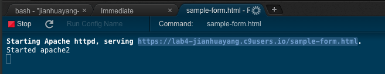
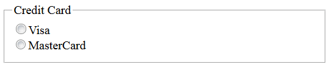
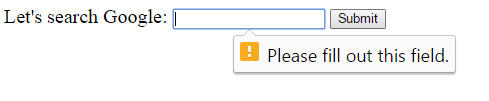

# HTML5 forms

In this lab, you learn how to create a form which is a collection of controls that accept information from the user and sends the information to a web server.

The information is sent to the server as a query string. We will learn more on interacting with the user, later on, using Javascript and Flask.

In this lab you do the following tasks, it takes approximately 2 hours:

- Create an HTML5 form.
- Use HTML5 for controlling the data types.

## Introduce HTML5 forms

### A very basic form

First, create a create a file called **sample-form.html**.

In the newly created HTML file, add the following lines of code:

```html
<form action="http://www.google.com/search">
  <div>
    Let's search Google:
    <input name="q">
    <input type="submit">
  </div>
</form>
```

Notice that as an action it refers to [Google's search engine](http://www.google.com/search). It gives a URL where the user's input data is sent. The `<div>` tag defines a division or a section in an HTML document. `<input>` tags are for many, but not all, input fields, as we'll see later. `<input>` is another example of a void element.

Right click sample-form.html and select Run. In the terminal window copy the URL and pastes into a new browser tab. Now when you write something into the box and click submit, your text is sent to Google's search engine.



Notice how you see parameters passed in a URL. Depending on where you're (i.e. locale), if you're at Helsinki, you'll see something like

```html
https://www.google.fi/search?q=YOUR_QUERY_GOES_HERE
```
or if you're at Coventry you'll see

```html
https://www.google.co.uk/search?q=YOUR_QUERY_GOES_HERE
```

This means that we are using `GET` method to send out data to the server. The method is not explicitly written in the form tag, therefore, the default (= `GET`) is used.

Everything that the user writes in the form is shown in the URL. In our case, Google needs only one parameter which is called `q`. The general syntax for URL query string is

```
URL?name1=value1&name2=value2&name3=value3.....
```

In most cases we don't want this, the usual way is to use `POST` method (which will be discussed later). Confidential data is recommended to be sent by `POST` methods.

When discussing REST APIs, we will have even more methods like INSERT and DELETE.

HTML form is just a set of things, which are called controls. They are elements of different types like text fields, checkboxes, radio buttons, submit buttons, and more. The `<input>` element is the most important form element, it has no content and is self-closing (i.e. void element). 

In our form, we have 2 input elements. The first one is for text input and we named it `q` because it happens to be the Google search string. 

> The convention is to use camelCase for things such as name/id, which is the same as in JavaScript. However, in this case, it has to be `q` as this is what Google expects.

It is important to have the name attribute on each input control and name should be unique. This is how browser knows how to send control's data to the server. You'll find out more about this later in the module.

Second input element's type is `submit` which generates a submit button for the user. This one sends the form information to the URL mentioned in the action.

### Test your understanding

1. Create a file called **form-skel.html**. You can download from current workspace folder and then transfer to your C9 workspace. Or you can create a new file in your C9 workspace and copy/paste contents into it. The file can be found in [here](https://github.com/covcom/205CDE/blob/c9/04%20HTML5%20forms/workspace/form-skel.html).
2. Insert the required input elements in the file and check that you have them all. You can use text input type for all but submit button.

## Control inputs

### Type attributes

HTML defines a number of input types that can be used in forms. The commonly used ones are:

- Plain text: `<input type="text">`
- Radio buttons: `<input type="radio">`
- Check boxes: `<input type="checkbox">`
- Password fields: `<input type="password">`
- Email addresses: `<input type="email">`

The above are supported by most browsers. There're some new input types also:

- URL addresses: `<input type="url">`
- Numeric data: `<input type="number">`
- Date pickers: `<input type="date">`

The main reason for introducing these new input types is for mobile devices with limited screen sizes where special keyboards/input methods can be used.  But note that not every browser supports the new types.

> Input types, not supported by old web browsers, will behave as input type text. See [here](http://www.w3schools.com/html/html_form_input_types.asp).


### Hidden parameters

Sometimes we need a way to submit some additional parameter to the server. This can be done by using a `hidden` input parameter.
A hidden parameter has no onscreen appearance, but it will be sent to the server.

```html
<form>
......
    <input type="hidden" name="org" value="Acme" />
    ....
</form>
```

### Drop-down lists

The `select` element defines a drop-down list, and the `option` element is used to define a list item.

```html
<select name="example"> 
<option value="notknown">Not selected</option>
<option value="item1">Item 1</option> 
</select>
```

Every `option` element should have a unique value, just like in checkboxes and radio buttons.

### Reset button

Earlier `Reset` buttons were common, they are used to reset a form's data to its initial value.

```html
<form>
......
    <input type="reset" value="Reset everything!" />
    ....
</form>
```

The reason for this was that on web page designers wanted to follow usability heuristics of user control and freedom by allowing users an "emergency exit" out of any situation they may have entered.

Unfortunately `Reset` buttons almost never help users but often hurt them. It is better to give users other ways to accomplish undoing.

For example in the case of text fields or checkboxes, the user can always erase the entry and revert to the original state.

Radio buttons and checkboxes and pull-down menus are trickier. A classic design mistake on the Web is to have radio buttons that initially do not have a selection. Often, there is no way for the user to select a "nothing" option, once he or she has selected one of the choices. Also selectable menus should include an explicitly selectable menu entry in pull-down menus for the default choice. 

There is one exception where `Reset` buttons can be used. This is when 

- the same user does repeat form-filling and
- the data to be entered differs significantly from one use of the form to the next

In other cases, it is easier for the user to edit the old data than to erase it and start from scratch.

### Test your understanding

1. Open file **form-skel.html**. Change your input types for the input elements to appropriate values.
2. Try to put incorrect data in your form and check the browser's support for types.
3. Implement a 'reset' button to reset the form-data to its initial values.

## Make it easier for the user

We have a couple of ways to help the user with forms.

### Connect label with control 

`label` elements are used to connect texts and controls that are used together in forms. For example radio buttons and check boxes often come with preceding texts that describe the choice. However if the user clicks the text nothing happens. That's because the browser doesn't know the connection between the text and the neighboring control. They must be wrapped up with label element.

```html
<form action="">
<input type="checkbox" name="bike" value="Bike">I have a bike<br>
<input type="checkbox" name="car" value="Car">I have a car 
</form>
```

You have to click on the box. But if you have

```html
<form action="">
<label><input type="checkbox" name="bike" value="Bike">I have a bike</label><br>
<label><input type="checkbox" name="car" value="Car">I have a car </label>
</form>
```
It is enough to click on text too.

Note the above can also be written as the following, which is also valid but needs more typing

```html
<form action="">
<input type="checkbox" name="bike" id="bike" value="Bike"><label for="bike">I have a bike</label><br>
<input type="checkbox" name="car" id="car" value="Car"><label for="car">I have a car </label>
</form>
```

> Read discussions on [StackOverFlow](http://stackoverflow.com/questions/774054/should-i-put-input-tag-inside-label-tag) for different ways of associating labels and inputs.

### Use grouping and hints

In many user interfaces, you can see how different elements on the screen are grouped together in order to make the input easier for the user. In HTML, you can use `fieldset` element for this.

```html
<form action="">
<fieldset>
<legend>Credit Card</legend>
<label><input type="radio" name="card" value="Visa">Visa</label><br>
<label><input type="radio" name="card" value="MCard">MasterCard </label>
</fieldset>
</form>
```
What you get is



In user interfaces it also a common practice to give hints on the kind of data is expected. In HTML, this can be achieved by `value` or `placeholder` attribute on the controls. The `placeholder` attribute's text disappears once the control is clicked in or gains focus and the `value` attribute's text stays in place when a control has focus unless a user manually deletes it.


### Test your understanding

Open Open file **form-skel.html**:

2. At the moment, you have to click exactly the right spot on your checkboxes etc. Change this by using labels.
3. Rearrange your form with legends and fieldsets in order to make it easier for the user to understand.
4. Give input hints to the user whenever possible.

## Form validation

Form validation is traditionally done using JavaScript. But HTML5 introduces some new ways of doing it, which makes validation a lot easier. 

### 'required' attribute

Now return to the very first example in this lab

```html
<form action="http://www.google.com/search">
  <div>
    Let's search Google:
    <input name="q">
    <input type="submit">
  </div>
</form>
```

If we add a `required` attribute to the query input, it will become `<input required name="q">`. In this case, the query field is required. In other words, if we don't type in anything in this field, we'll have an error message when trying to click submit.

.

Behind the scene, the browser tries to verify user's input. There're some other input attributes that can serve for validation purposes. For example, `min` and `max` attributes for numerical input types such as `number` or `month`; `size` and `maxlength` for limiting the number of characters entered.

### 'pattern' attribute based on regular expression

In addition to using different input types, we can also use patterns a.k.a.regular expressions. Using patterns, we can validate user inputs even more precisely. 

Pattern is an encoded sequence of characters that define a pattern of text characters. Remember that client-side validation is not reliable as the only means of validation, it is useful to make the user interface more pleasant.

For example, a Finnish social security number (similar to UK National Insurance number) is often 999999-999X (for those who are born in the 20th century). The first 6 digits are the birth date: day, month and year's last two numbers. After "-" there are 3 digits and the last character can be either digit or letter from A to Y. If we want to make a pattern of this, it would be

```html
<input type="text" pattern="\d{6}\-\d{3}([0-9A-Y])" ...>
```
\d means a digit, \\- means the "-", [chars] means a set of characters.

### Test your understanding

* Open file **form-skel.html**. Validate the user's data in Student id, email address and score by using patterns.


