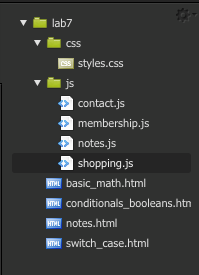
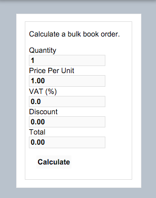
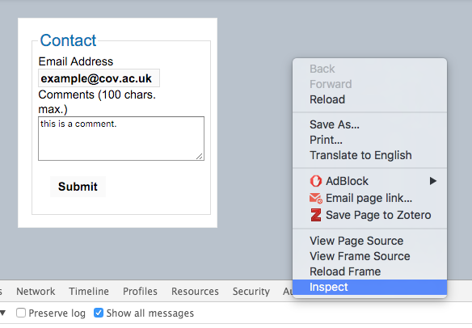
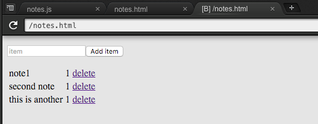
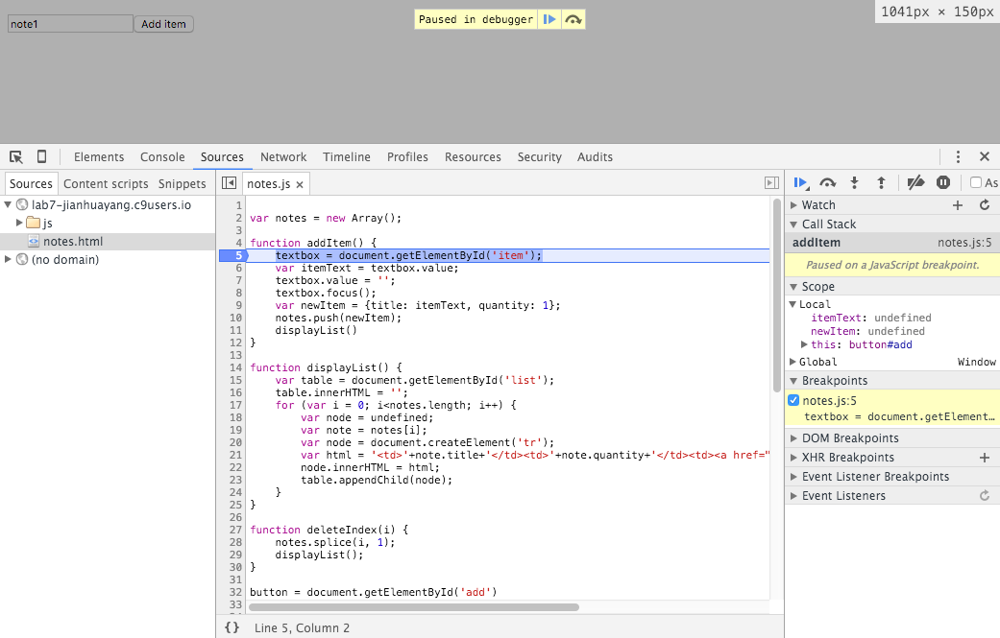

# JavaScript syntax

From this week, we start doing JavaScript, which is the language for the modern web development, and also the language of the future.

> [What Is The Most Valuable Programming Language To Know For The Future And Why?](http://www.forbes.com/sites/quora/2014/07/14/what-is-the-most-valuable-programming-language-to-know-for-the-future-and-why/#425503b66439)

You need to learn JS for the following reasons (since I've been asked several times in the past):

1. You want to use JS to add interactivity to your website, which greatly enhances user experience.
2. JS is an essential component of Bootstrap, which is a popular front-end framework introduced later in the module.
3. You need JS for your 3rd-year module [305CDE Developing the Modern Web 2](https://github.com/covcom/305CDE), that teaches [full stack JavaScript development](https://www.smashingmagazine.com/2013/11/introduction-to-full-stack-javascript/).

To help you get acquainted with the syntax used in JavaScript, use a tutorial such as [Mozilla developer network](https://developer.mozilla.org/en-US/docs/Web/JavaScript/Guide/Introduction) or [W3Schools JavaScript tutorial](http://www.w3schools.com/js/). You will learn that several JavaScript constructs, such as the control structures are very similar to Java.

> For this and following labs you'll need to clone the module repository in your C9 workspace. Instruction were given [here](https://github.com/covcom/305CDE).

> Some of the JS exercises were based on tutorials written by [Colin Stephen](https://github.com/c0lin). 

## Edit and test JS code

In the Workspace tool window navigate to lab7 ==> workspace, the folder structure is like this:

Double-click to open the file **basic_math.html**, and right-click on the same file to preview.

In the same manner, open **shopping.js** located in the `js` folder. 

Now do the following:

* Try out the application by entering different values and clicking on the Calculate link.
* Read through comments in the JS file, and try to understand the code. You can now make changes to the code. 

### Test your understanding

1. The values read from the text boxes are stored as *strings*. Modify the code to store the quantity to an *integer* and the price, tax and discount as *floats* (hint, check the crib sheet).
2. Modify the JS code to double the discount applied when the quantity ordered is greater than 100 items
3. Modify the HTML form to include a *shipping* field, and include this value in the total calculation in `shopping.js`.

You'll need to press `ctrl` + `s` to save changes after modification. To view the modified version simply refresh the web browser tab running your web page.

## Chrome developer tools

You've (hopefully) seen Chrome developer tools in the previous lab, where you inspected CSS rules applied to HTML elements. In the example that follows you will be using the Chrome Developer Tools to see outputs from JS code.

### Console output

Load up **conditionals_booleans.html** and run it in a new browser tab.
Enter some valid inputs into the form and submit it.

"Nothing" happens. . . Actually, the result is being logged to the console which is a part of the Chrome Developer Tools integrated into the browser.

1. Right click within the preview browser window and select Inspect to open the Developer Tools panel. This can be docked to the right or bottom of the main window (bottom preferable).
2. Click on the console tab and try submitting the form again (you can ignore errors at this point) to see the output.
3. Go back to **contact.js** to see where this output comes from

### Test your understanding

1. Load up **conditionals_booleans.html** and modify the HTML form to include a "Full Name" field
2. Add validation in contact.js to ensure that the name entered has, at least, two parts separated by space, and is between 3 and 100 characters in length

## Language analysis

### JSLint code checking

Writing clean, readable, and error-free high-quality code is essential to maintainability. Therefore most languages now have automated syntax and style "checkers" called linters that code editors and IDEs can use to alert potential problems to programmers immediately when they are writing their code.

One such linter for JavaScript is called [JSLint](http://www.jslint.com/), and it is built into C9 and enabled by default.

> [JSLint](http://www.jslint.com/) provides checks based on direct input, similar to HTML/CSS validation.

Load up **notes.js** in C9 and you'll see immediately there're some highlights in the gutter. If you move your mouse over you'll see some hints on the error.

In general, C9 supports three types of identifiers:

1. Informational: these are non-critical, non-dangerous updates about your code
2. Warnings: these are potentially incorrect pieces of code
3. Errors: these are incorrect lines of code that will almost certainly throw a runtime error when you try to run/compile your code

> Click [here](https://docs.c9.io/docs/language-analysis) to visit the official documentation on C9.

Preview **notes.html** in C9 and input some texts to prove the code is fully functional. 

Next, open **notes.js** and make sure you understand how it works.

1. Click on the icons in the gutter to read warning messages
2. Try to make changes to correctly format the code

Note that many of the highlighted issues are about things like indentation, and consistency of style, as well as syntax. That is because linters take readable code very seriously, and so should you! You should aim to have no JSLint warnings when you write your JavaScript or other programming code.

### Strict mode

JavaScript’s strict mode allows you to use a safer, restricted version of the language. It makes changes to the semantics to help you avoid many common errors. For example, if you don’t use the `var` keyword when declaring variables these become globally scoped. With strict mode enabled these get flagged up as errors.

To enable strict mode, you simply add a line of code.

`"use strict";`

This can be added to the top of your script if you want it to apply to everything, alternatively, it can be implemented only in certain blocks of code by adding it there instead.

Click [here](http://www.w3schools.com/js/js_strict.asp) for some more examples on `use strict`'

### Test your understanding

Once you have corrected for any JSLint errors found by the code linter (**notes.js**), copy/paste the code into [JSLint](http://www.jslint.com/) and run the analysis. Google the error messages that pop up, and make changes as appropriate.

## Basic debugging

For a much more detailed description read [Google’s debugging JavaScript guide](https://developer.chrome.com/devtools/docs/javascript-debugging).

Sometimes your attempts to change the code will introduce bugs. A bug is usually signalled by some kind of error message, usually RED in colour, appearing on the console. If you find a bug has appeared in your code do the following to help track it down:

1. Note the line number that caused the problem, if any is mentioned in the console output (sometimes it is not)
2. Load the 'Sources' tab in the developer tools area and select the JS file
3. Click in the margin next to any line number to add a code break (add it near but before the suspect line); you can add several if you wish
4. Now refresh the page and proceed as normal until the code execution stops at the line break you created
5. On the information tab on the right-hand side, you will see details about the call stack and currently scoped variables to help you pinpoint the state of your program
6. Use the "Step over / into / out of" buttons to execute your JS line by line and keep an eye on the stack and scope to catch anything unexpected

Let's get familiar with the debugger:

1. Make sure you're viewing your webpage using the live privew in a new tab. This is important.
1. Click on the Sources tab and open the notes.js file
2. Click in the margin to add a breakpoint to the first line of the addItem() function.
3. Refresh the browser, type in a new item and click the button. The execution will pause at the breakpoint without running line 5.
4. Click on the Step into next function call button (down arrow with dot). This will run line 5 and move execution to line 6. Click this button to execute the code line by line.
5. Observe the variables changing in the right-hand panel.

### Test your understanding

Use the debugger to help fix a problem with our program:

It is currently possible to add duplicate items. Instead of adding duplicated the quantity should increase by one.

