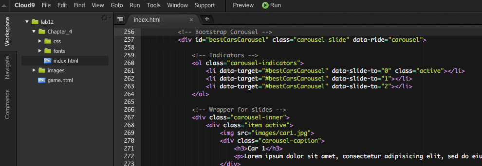

# Bootstrap framework

CSS3 introduced media query technique to check browser properties such as window size or orientation. Using media queries, one can build websites suitable to be viewed using different browsers on different platforms. In other words, the goal is to build responsive websites, i.e. sites that scale well when viewed by various devices such as desktop and mobile devices. 


Bootstrap is a popular front-end framework (HTML, CSS, and JS)that provides responsiveness -- it simplifies the design of a website and makes it much easier to create sites that are responsive. 

## Bootstrap CSS

### Link to Bootstrap stylesheets

In this example, we design a web page for a fictitious computer game. 

First, open a HTML5 file called **game.html**. Insert the following lines inside the head element of the HTML page:

```html
    <title>Space Escape</title>
    <meta charset="utf-8">
    <meta name="viewport" content="width=device-width, initial-scale=1">
    <!-- Latest compiled and minified CSS -->
    <link rel="stylesheet" href="https://maxcdn.bootstrapcdn.com/bootstrap/3.3.6/css/bootstrap.min.css">
    <!-- jQuery library -->
    <script src="https://ajax.googleapis.com/ajax/libs/jquery/1.12.0/jquery.min.js"></script>
    <!-- Latest compiled JavaScript -->
    <script src="https://maxcdn.bootstrapcdn.com/bootstrap/3.3.6/js/bootstrap.min.js"></script>
```

> Most online tutorials use HTTP protocol for Bootstrap hosting. But here on C9, you'll have to use https to be consistent with jQuery.

Note here we included a link to the jQuery library. This is required by the Bootstrap framework.

### Add content

Once the Bootstrap stylesheets are linked, you can start designing your content.

The overall layout is achieved using div elements that carry a specific class name. For instance, a responsive container for the content is created by adding the following lines in the `body`element:

```html
<div class="container">
  <h1>Space Escape</h1>
    <p>Space Escape is a text adventure game where Per Finn, the protagonist, dares to venture the uncharted realms of planet Mars. Be prepared for thrill and suspension!</p>
</div>
```

The class above, `container` is the main class for holding contents. Alternatively, class `container-fluid` can be used to get a full-width container.

Now, you can apply the grid model of bootstrap to divide the area below the previous element into three equally spaced columns, each having some content. Within the `container` element, add the following nested elements:

```html
 <div class="row">
     <div class="col-sm-4">
         <h2>Setup</h2>
         <p>Per Finn and his assistant have succesfully landed in Mars. As soon as the engines are turned off, there is a loud knock at the door of the outer airlock. Who could that be?</p>
     </div>
     <div class="col-sm-4">
         <h2>Characters</h2>
         <dl>
             <dt>Per Finn</dt><dd>Brave adventurer</dd>
             <dt>Urpo McMahon</dt><dd>Per's loyal assistant</dd>
         </dl>
     </div>
     <div class="col-sm-4">
         <h2>Hazards</h2>
         <ul>
             <li>Galactic reptiles</li>
             <li>Martian slime ponds</li>
             <li>Ashphyxia</li>
         </ul>
     </div>
</div>
```

Try the page in the browser. Resize the window to emulate a mobile device.

Above, the grid model was specified by including three div-elements specifying class `col-sm-4`. In Bootstrap, the content area is split into 12 parts. Thus, for example, two equally wide elements would be obtained by class `col-sm-6`.

### Styling

Bootstrap has defined styles for HTML elements such as headings and paragraphs. Most elements can be further enhanced with CSS classes.

As an example, add add an image with rounded corners into an empty paragrap element in the main container:

```html
<p>

</p>
```

The class definition, `img-rounded` has the desired effect on the outlook of the image.

The available Bootstrap classes for various purposes can be best found using a reference.

For Bootstrap reference, use sources such as:

- W3Schools Bootstrap tutorial: http://www.w3schools.com/bootstrap/
- Tutorial Republic Bootstrap tutorial: http://www.tutorialrepublic.com/twitter-bootstrap-tutorial/
- Bootstrap homepage: http://getbootstrap.com/

Add more content to the page and test the outcome in a browser. Test responsiveness by resizing the browser window and/or opening the page in a mobile device.

### Test your understanding

Add the following elements into the **game.html** page:
* a well (a gray area with rounded edges), that contains facts about Mars.
* home, previous and next buttons (functionality not required). Use pager class.

## Bootstrap JS

Besides CSS stylesheets for responsive designs, Bootstrap also includes some Javascript functionality. A popular Bootstrap JS component is carousel.js. 

Take a look at the official documentation to see the some examples, click [here](http://getbootstrap.com/javascript/#carousel).

The official documentation of Bootstrap is, however, somehow difficult to understand. In the reading list, I recommended a book titled ['Jump Start Bootstrap'](http://www.sitepoint.com/store/jump-start-bootstrap/). The source code of examples used in the book can be found [here](https://github.com/spbooks/jsbootstrap1). 

Click on the link mentioned above and navigate to **Chapter_4.zip**. Download **Chapter_4.zip** and unzip it on your computer. Upload all contents into your C9 workspace.



> For copyright reasons the files are not included in the module repository. 

Preview the index.html page, and navigate down to where you see images of posh cars.


Note the carousel part starts from line 256 in the source code:

* Every carousel plugin has three subsections in it: indicators, body, and controls.
* Indicators are the little dots, body is the actual image, and controls are chevrons.
* Indicators are lists, and the number of list items corresponds to the number of images.
* Extensive `div` tags are being used.

### Test your understanding

1. In your workspace, create a new HTML file and copy the carousel part over from index.html, in addition to the `head` part.
1. Replace the `img` tag, use images with absolute path i.e. 'http://...' instead
2. The Bootstrap API doesn't allow you to change the sliding speed. Try and figure out a way of doing it. (hint: Google)


