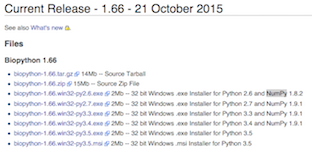
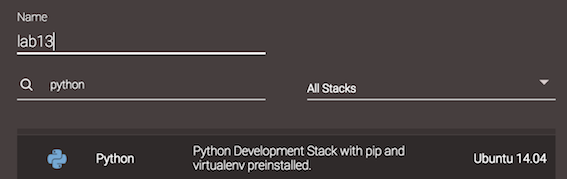
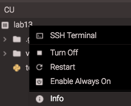

# Basic Flask

From this week, we'll start concentrating on [Flask](http://flask.pocoo.org). The ultimate aim is to build a dynamic website using all previous things you've learned so far. That is HTML/CSS/JavaScript/Bootstrap, and on top of it, Python-based Flask operating templates and an SQLite database.

## You should know some Python already

This module assumes that you know some Python already. Below is a list of things you have learned in 121COM Introduction to Computing:

* First Steps and First Mistakes
* Taking Control
* Importing and Iteration
* Professional Functions
* Recursion
* Working with Data
* Dealing with Errors
* Encapsulation
* Inheritance
* Paradigms and Languages

In this module, we'll need everything in this list, and a little bit more. To recall what you have learned, the best way is to find your own notes and read. Make sure that your Python level comes back to where you left off.

If you are exchange students who haven't done much Python, or you did 121COM but it feels like it's ages ago, you need to start from the very beginning. Python is huge, but we don't have to know everything before we can get started on Flask. Choose one of the following approaches that suit you the best. 

* You can find plenty online tutorials. Personally, I found the following particularly useful. ['A Quick, Painless Tutorial on the Python Language'](http://heather.cs.ucdavis.edu/~matloff/Python/PythonIntro.html), written by Professor Norman Matloff at UC Davis. Unfortunately, the website is not being actively maintained. But in the module repository, you can find a pdf version.
* If you prefer interactive learning, you can use [Codecademy](https://www.codecademy.com/learn/python) or [Learnpython](http://www.learnpython.org/).

> Be aware that the Flask built-in web server is not for production environment. For that, you'll need to use something such as [Apache module mod_wsgi](http://flask.pocoo.org/docs/0.10/deploying/).

## Virtual environments

Python is very popular. A by-product of this popularity is that it has many different packages, that depend on different versions of the language and different versions of other packages. This is like a chain reaction.

> Probably due to the popularity of Python, its creator [Guido Van Rossum](https://en.wikipedia.org/wiki/Guido_van_Rossum) got a good offer from Google. But later on, he got an even better one from Dropbox in 2012. 

As an example of this really bad situation, have a look at a popular Python library called [Biopython](http://biopython.org/wiki/Download) (used mainly for bioinformatics analysis) below. Depending on the version of Python language, a single release of Biopython has around 10 different flavors. Also, Biopython relies on [NumPy](http://www.numpy.org/), which is used for numerical analysis and which doesn't live in a vacuum. So you can imagine the situation can get really bad.



A remedy to this is to use virtual environments. A Virtual Environment is a tool to keep the dependencies required by different projects in separate places, by creating virtual Python environments for them.

> If you use Codeanywhere, you'll need to create a container based on Ubuntu 14.04 Python stack. For this module, we don't (yet) use Python 3 as it's [not quite compatible with some modules](http://flask.pocoo.org/docs/0.12/python3/).

>  

Go to the terminal window, type in the following command `virtualenv` you should see the 'help page' (i.e. documentation) for this command. Essentially it's a bunch of texts indicating how to use it. If instead you get 'command not found' you'll need to install 'virtualenv' using the following

```bash
sudo pip install virtualenv
```

Once done, run the following to create a virtual environment called 'venv'.

```bash
virtualenv venv
```

Next, run the following to activate the newly created virtual environment.

```bash
. venv/bin/activate
```

> Don't forget the leading `.` at the second line, this means the current folder. An alternative to this is the `source` command, click [here](http://superuser.com/questions/46139/what-does-source-do) for more details.

Now install Flask in the virtual environment using the following

```bash
pip install flask
```

Note that once activated, whatever you install will be installed in this virtual environment. As a proof, you'll see that some new folders appear in your `venv/lib/site-packages/` folder, including several that begins with the work flask. The installation is now complete.

You can use the following command to leave the virtual environment.

```bash
deactivate
```

### Hello World!

The tradition in teaching programming language is to start with a 'Hello world' program. We'll follow this tradition.

Create a new file called 'hello_flask.py' in your workspace, and insert following lines into it.

```python
from flask import Flask
import os

app = Flask(__name__)

@app.route('/')
def hello_world():
    return 'Hello World!'

if __name__ == '__main__':
    app.debug = True
    port = int(os.getenv('PORT', 8080))
    host = os.getenv('IP', '0.0.0.0')
    app.run(port=port, host=host)
```

We'll come back to this file later. Now go into the terminal and issue the following command `python hello_flask.py`, the system will prompt you with something like 'Running on http://0.0.0.0:8080/ (Press CTRL+C to quit)...'.

Now you have a server listening on port 8080. But we don't know the IP address! Right-click on the container in CodeAnywhere and select 'info', in the window that pops up locate the URL in the format of 'http://[a-z0-9]+\.codeanyapp\.com', 



Paste that URL suffixed with the port number into a new browser tab, what you'll see 'Hello World!' coming up in your browser. Congratulations, your first Flask website is up and running!

Now go back to the code we inserted into the file. There are several important concepts in it:

* `Flask` is a class, it accepts several different input parameters. The one we supplied is the name of the current module. This name is used to uniquely identified the currently running app.
* Line begins with `@` is called a decorator. This is used to modify the function (in the current case 'hello_word()'.) The modified function then becomes associated with route `/`, so that when a request is being sent to `/` i.e. the root folder of the website, this function will be run.
* The function is called a view function. In this example, the function returns a simple string. This string is internally cast into a response object, which is then returned by the server.
* The statement `__name__ == '__main__'` tests if the current file is being executed or being imported. If it's the former, this statement will evaluate to `True` and we'll run the app on specified IP address and port.

Note here PORT is an environment variable, it can be displayed in your terminal using

```bash
echo $PORT
```

> Here using port 8080 and IP address 0.0.0.0 is necessary as otherwise online IDEs will listen to localhost only and you won't be able to access the server from outside of your workspace. However, if you run Flask on your local machine, the default IP address and port are `http://127.0.0.1:5000`. 


## Notes on the official Flask tutorial

On the official Flask website, there's a [tutorial](http://flask.pocoo.org/docs/0.10/tutorial/). You can follow instructions there and see how far you can go. Don't worry if you don't completely understand, we'll cover them all in the next 2/3 weeks time. Bear in mind this tutorial is written in a very casual style. In your final submission, you want to avoid things like this:

* In step 1, a column of `primary key autoincrement` was created. However, in SQLite, we don't normally (that is DON'T) declare 'autoincrement', see [here](https://www.sqlite.org/autoinc.html) the official documentation.
* In step 1, SQL keywords should have been capitalized.
* In step 6, some tags weren't used properly. For example, HTML in doctype should be capitalized; `strong` tag should be avoided and use CSS to [achieve richer effect](http://www.w3schools.com/tags/tag_strong.asp).

## PyCharm

There is a Python IDE called [PyCharm](https://www.jetbrains.com/student/). The software normally costs £149 a year but is free for educational purposes. Feel free to use for our current module.

