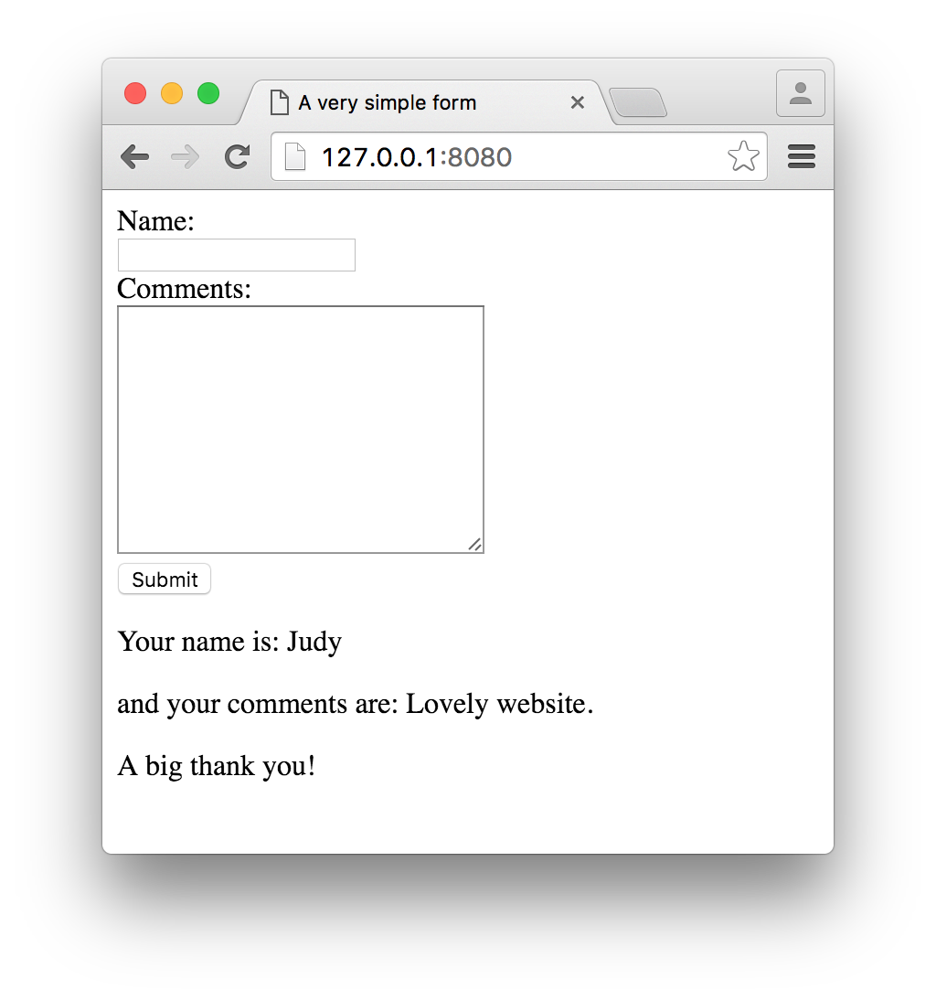
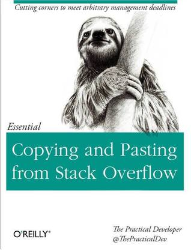

# Flask SQLite

Last week we looked at how to combine HTM/CSS with the Python language using Jinja2 templating system. This combination is very powerful as it overcomes some limitations associated with HTML such as the lack of flow control mechanims. 

This week we'll rely Python language's SQL handling capabilites to build websites that is capable of connecting/manipulating daat in a relational database. The excercises that follow conclude the current module.

## Forms in Flask

Before you manipulate data using SQLite, you need to collect user inputs using forms. There're several different ways of presenting forms in Flask, obviously they all have pros/cons. Let's examine them all.

### Pure HTML forms

In your C9 workspace, create a new file called 'form_simple.html' and put it in a folder called 'tempaltes' (note: ploral, not template). Insert the following code into this file.

```html
<!doctype html>
<html lang="en">
<head>
    <meta charset="UTF-8">
    <title>A very simple form</title>
</head>
<body>
<form action="" method="post">
    <label for="nameId">Name:</label>
    <br>
    <input type="text" name="name" id="nameId">
    <br>
    <label for="commentsId">Comments:</label>
    <br>
    <textarea name="comments" id="commentsId" cols="30" rows="10"></textarea>
    <br>
    <input type="submit" value="Submit">
</form>


    <p> Your name is: {{ name }}</p>
    <p>and your comments are: {{ comments }}</p>
    <p>A big thank you!</p>


</body>
</html>
```

If you did last week's excercises, this is easy to understand -- it's just a simple Jinja2 template with a standart HTML form in it.

Next, in workspace folder create a file called 'form_simple.py' and insert the following code

```python
from flask import Flask, render_template, request

app = Flask(__name__)


@app.route('/', methods=['GET', 'post'])
def view_form():
    if request.method == 'POST':
        name = request.form['name'];
        comments = request.form['comments']
        return render_template('form_simple.html', name=name, comments=comments)
    else:
        return render_template('form_simple.html')


if __name__ == '__main__':
    app.run(port=8080, host='0.0.0.0', debug=True)
```

The majority of the code should look familiar, apart from the following two:

1. The function decorator takes an additional 'method' argument. By defaul (without the 'method' argument), the current route i.e. `/` will only respond to `GET` method. That's what happens when people try to view a webpages. However, when they try to send data in a form, they will have to specify either 'POST' or 'PUT' in the form's `method` attribute. When you design your route, you'll need to respond to that **HTTP method**.
2. 'request' here is an object that encapsulates the contents of a HTTP request sent by the client (normally a browser). Here we use it to access the data contained in the form. 

If you run the code, type in something and hit 'submit', what you'll see is similar to below. The info you just typed in has be displayed back.



> Last week we had some problems with C9, and I suggested that you register a free tiral account on Codio that lasts for 30 days (only). In case needed, you may consider get [PyCharm](https://www.jetbrains.com/student/) installed on your desktop, which normally costs £149 a year but is free for educational purposes. At the moment you don't have to do this as C9 came back to normal.

> 

### Bootstrap forms

Obviously pure HTML forms work, but as you can see it doesn't look very nice. Using the Flask-Bootstrap extension we can take advantage of existing CSS rules in Bootstrap.


### Forms using WTF


## SQLite integration

### Collect user inputs

### Save data in SQLite

## Advanced


> 

> There's a new book came out recently using [Zootopia's Flash](http://disney.wikia.com/wiki/Flash) as cover image. Grab a copy of the book and see if it makes differences.


### Flask-SQLAlchemy

### Flask-Mail

