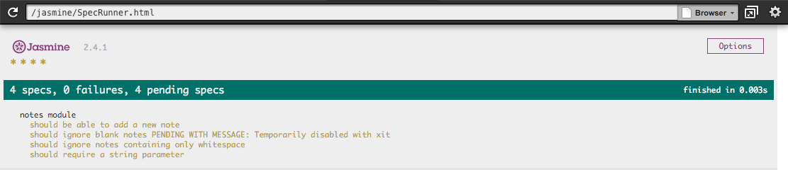
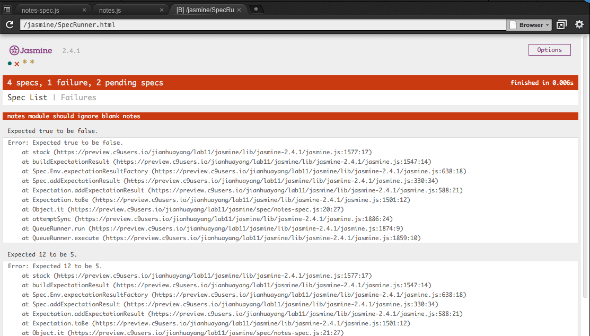

# JS testing

Every time you make changes to your code you have to save the changes, reload the page, enter the details in the form and press the button. There has to be an easier way!

Welcome to the world of _automated testing_. In fact, test-driven development (TDD) is a fundamental (and huge) topic in software engineering. In this lab, we'll look at two JS libraries that allow us to write scripts to test our web app is working correctly. 

## Test-driven development

So what is TDD? let's start by looking at the definition on [Wikipedia](https://en.wikipedia.org/wiki/Test-driven_development).

> Test-driven development is a software development process that relies on the repetition of a very short development cycle: first the developer writes an automated test case that defines a desired improvement or new function, then produces the minimum amount of code to pass that test, and finally refactors the new code

So from this definition we can see three distinct steps:

1. write an automated test to define an improvement or new function
2. produce enough code to pass the test
3. refactor (clean up) the code without breaking the tests.


TDD is an important process to learn. You should ensure you apply this process to all future work in this module. You are also encouraged to use TDD methodologies in your other modules.

## Unit testing with Jasmine

In this exercise, you will be introduced to the concept of unit testing. You will install the Jasmine Behaviour-Driven Development framework, configure a test runner and build tests.

> For this current exercise using Jasmine, you don't need the module repository. In fact, try not to look there as it contains finished answers.

### Install Jasmine

To get a link to the current Jasmine release, visit the [download page](https://github.com/jasmine/jasmine/releases) and click on the 'Latest release' button then right-click on the zip button and copy the URL to the clipboard.


> Ensure you click through on GitHub to view the correct URL for the raw zip file (the `view raw` link. Do not use the link to the zip file appearing in the `jasmine/dist` directory in the repo.

Next, open your terminal window in C9 workspace, and issue the following commands:

    ```bash
    mkdir jasmine
    cd jasmine
    wget https://github.com/jasmine/jasmine/releases/download/v2.4.1/jasmine-standalone-2.4.1.zip
    unzip jasmine-standalone-2.4.1.zip
    rm jasmine-standalone-2.4.1.zip
    rm -rf spec/*
    rm -rf src/*
    ```

What the above commands did is that we create a folder called jasmine and download Jasmine package into it using `wget`. Then we `unzip` the file and delete the *original zip file*. Finally, delete the contents of two sub-directories `spec` and `src`.

The src directory is where we will save our JavaScript modules. The spec directory is where we will save our unit tests.

    ```
    .
    ├── lib
    │   └── jasmine-2.4.1
    ├── MIT.LICENSE
    ├── spec
    ├── SpecRunner.html 
    └── src
    ```

### Edit the spec runner

Let's add a module file and its corresponding test. Create a file called `notes.js`  in the src directory. This will contain our module code. Next create a file called  notes.spec.js  in the spec directory. This will contain the unit tests. Note the naming convention, the unit test file is the same as the module file with .spec added before the file extension.

We need to tell Jasmine about our two files. This is done in the file  SpecRunner.html  in the source file and spec file sections (these are clearly labeled). You will also need to delete the existing entries since we have deleted these files.

```html
  <!-- include source files here... -->
  <script src="src/notes.js"></script>

  <!-- include spec files here... -->
  <script src="spec/notes.spec.js"></script>
```

Finally, load up `SpecRunner.html` in the browser inside C9. You should get a web page indicating that no specs have been found (that's OK because we have not written any).


### Define your tests

Before writing tests take a moment to understand the purpose of the module we will be writing. Specifically, we should write down the required functionality and, for each piece of functionality, how we can test for compliance.

We will be building a module called notes which will store a series of notes together with a Unix timestamp indicating when they were added. It will expose the following six public functions.

1. **add(note)**
    
    adds a new note to the module, the parameter is the text of the note. if an empty string is passed (or no parameter), nothing should be added. If nothing is added the function should return false, otherwise, it returns true.
    
2. **remove(index)**
    
    deletes the note at the specified index. returns true on success, if the index is missing or is out of bounds or a string it returns false.
    
3. **count()**
    
    returns the number of notes stored in the module.
    
4. **list()**
    
    returns an array containing all notes. Each note is an object that contains both the note and the timestamp.
    
5. **find(string)**
    
    returns an array containing all notes that contain the specified string. Each note is an object that contains both the note and the timestamp. If no matches are found it returns false. Search should not be case sensitive.
    
6.  **clear()**
    
    removes all the notes.

### Create a test suite

That all seems pretty clear, so now we can define the steps we need to take to test each of these. Before we carry out each of our tests we need to do a little setup. In our case, we should clear out the list and add some new notes.

Now let's start writing our tests. These live in test suites inside the spec/notes-spec.js file. Normally there is one suite per module you are testing. Each test suite needs to be given a name to describe the module it is testing.

```javascript
describe('notes module', function () {
  
});
```

> The workspace example uses the `()=>{}` syntax, which is equivalent. This is a new feature of ES6 called [arrow function expression](https://developer.mozilla.org/en/docs/Web/JavaScript/Reference/Functions/Arrow_functions).

Now if you refresh the spec runner web page you will see it has detected the test suite and has displayed its name:

#### Add pending specs

The next step is to add all the specs (tests) to the test suite. This will serve as a to-do list when we start writing the module. Specs are defined with the global function `it` which takes a string and an optional function. The string is the title and the function is the spec or test. If we leave out the function the spec is flagged as pending in the test harness.

```javascript
describe('notes module', function () {
    it('should be able to add a new note');
    it('should ignore blank notes');
    it('should ignore notes containing only whitespace');
    it('should require a string parameter');
});
```

If we run the test harness we can see that the four specs are flagged as pending. Also, notice the four asterisk characters running along the top of the green bar. This indicated that there are four specs we are not currently running.



#### Setup & teardown

Each test suite is self-contained and its tests need to operate in a known state to correctly test the module. To help ensure this, you can run a block of code before the suite runs any specs and a block of code after all the specs in the suite have completed. You can also run a block of code before each spec and a block of code after each spec. These are provided as four global Jasmine functions which take an anonymous function containing the code to run.

- beforeAll()
- afterAll()
- beforeEach()
- afterEach()

In our suite, we plan to empty out any notes and pre-populate the module with five notes before we run each spec.

```javascript
describe('notes module', function () {
  beforeEach(function() {
    notes.clear();
    notes.add('first note');
    notes.add('second note');
    notes.add('third note');
    notes.add('fourth note');
    notes.add('fifth note');
  });
  it('should be able to add a new note');
  it('should ignore blank notes');
  it('should ignore notes containing only whitespace');
  it('should require a string parameter');
});
```

From this point onward the entire suite code will be omitted from the examples in this worksheet to save space. We will be working on individual specs.

### Write the first spec

Each one of our tests will become a separate spec. The first one is testing to see if we can add a new note. We can test this by seeing if the count function returns '6'. function `toBe` is an example of a Jasmine matcher. There are lots of others, a full list can be found in the Jasmine documentation.

```javascript
it("should be able to add a new note", function () {
    expect(notes.add('sixth note')).toBe(true);
    expect(notes.count()).toBe(6);
});
```

If we refresh the test runner we should see the following. Note that the first asterisk is now a red cross. This means the spec is running but has failed. There are two views available, Spec List and Failures. We are looking at the failures view and the first of the two errors indicates the test got a value of undefined but was expecting the result to be true.


We are getting a failed test! If you think about it this is because we have not written any code in our module. We should, therefore, start by creating a module and stubbing the public functions. In this example, we are writing our module as an immediately invoked function expression (IIFE) that return an object called notes.

```javascript
var notes = (function() {
  return {
    add: function(note) {},
    remove: function(index) {},
    count: function() {},
    list: function() {},
    find: function(str) {},
    clear: function() {};
    }
}());
```

#### Pass the Spec

We are now ready to start writing our module code. Let's look at the test runner again.


This tells us that the value returned is undefined but the spec was expecting '6'. To pass this test we need to implement both the add and count functions. Again, here is the first attempt.

```
var notes = (function() {
    var list = [];
    
    return {
        add: function(note) {
        var item = {timestamp: Date.now(), text: note};
            list.push(item);
            return true;
        },
    remove: function(index) {},
    count: function() {
        return list.length;
    },
    list: function() {},
    find: function(str) {},
    clear: function() {};
    }
}());
```

If we run our test runner it shows that the code we wrote was enough to pass the spec.


### Pass the second spec

In this one, we attempt to add an empty string. We expect the add function to return false. We also expect the notes count to be '5' because the note was not added.

```javascript
it("should ignore blank notes", function () {
    expect(notes.add('')).toBe(false);
    expect(notes.count()).toBe(5);
});
```

If we refresh the test runner we find that both tests in the spec fail.

```
Expected true to be false.
Expected 12 to be 5.
```



Let's try and fix the second one first. Somehow there were 12 notes instead of the 5 we expected. This looks as if the notes are not being removed between specs. The culprit is the clear() function which has not been implemented. Here is a minimal implementation.

```javascript
clear: function() {
list.splice(0, list.length);
}
```

Running the spec again still shows both tests failed but the second error is different.
```
Expected true to be false.
Expected 6 to be 5.
```

That's better. Now we can see that the blank note is being added and the function is still returning true instead of false.

Let's make enough changes to the add function to let it pass the tests.
```
add: function(note) {
    if (note) {
        var item = {timestamp: Date.now(), text: note};
        list.push(item);
        return true;
    }
    return false;
}
```

The test runner now shows that both tests pass. Notice how it runs all the specs every time. This means you get alerted if you break a test that previously passed.


### Write pending specs

Up until now you have written the tests as they were needed however a better workflow might be to write all your module tests up front. The problem with this is that you will get a huge list of errors when you start coding because every test will be run. The solution is to write the tests but mark them as pending until you are ready to run them.

We can flag up a spec as pending by calling the global Jasmine `pending()` function.

```
it('should ignore notes containing only whitespace', function() {
    expect(notes.add('   ')).toBe(false);
    expect(notes.count()).toBe(5);
    pending();
});

As an alternative, you can use `xit` instead of `it`. Any spec declared with `xit` is marked as pending.

xit('should require a string parameter', function() {
    expect(notes.add()).toBe(false);
    expect(notes.count()).toBe(5);
});
```

As you can see, these specs are flagged as pending and not run. This means you can design and code all your tests before starting to write your module, removing the pending flags one by one as the earlier tests pass.


### Nest test suites

Up until now, all your specs have been in a long list but for a complex module, it would make sense to use nesting to provide a clearer structure. So, for example, the test runner might look like this.


This is done by placing the related code inside testing sub-suites using the describe function. This makes the test runner easier to follow

```javascript
describe("notes module", function () {
  
    beforeEach(function() {});
  
    describe('adding a note', function() {
    
        it('should be able to add a new note', function () {
        // tests go here
        });
  
        it('should ignore blank notes', function () {
        // tests go here
        });
  
        it('should ignore notes containing only whitespace');
        it('should require a string parameter');
    });
  
    describe('deleting a note', function() {
        it('should be able to delete the first index');
        it('should be able to delete the last index');
        it('should return false if index is out of range');
        it('should return false if the parameter is missing');
    });
});
```
### Test your understanding

You have been given the first set of specs and shown how to pass the first few of these. You now need to complete the following activities:

1. complete the four specs to test the add functionality
2. devise tests for the remove and find functionality
3. write the specs to test the remove and find functionality
4. tidy up the code without breaking any of the tests.

## Acceptance testing (N.B.: advanced)

### Install CasperJS

The module GitHub folder for the current lab contains a sub-folder called **casperjs**. This directory contains a test script for each and every exercise in lab07 so jump in and try them out.


The scripts are run on the web server and are written in a flavor of JavaScript called ECMA6, you should take a few moments to learn more about this. They use a framework called **NodeJS** which you will learn more about next year in 305CDE. For now, you will be shown the steps needed to run the tests.

> 305CDE on [GitHub](https://github.com/covcom/305CDE), resource list at [Lanchester Library](http://resourcelists.coventry.ac.uk/lists/E2F7BB77-0B61-CA07-DCDD-07C203847C53.html).

The first step is to update NodeJS to the latest version (5.7.0 at the time of writing). Updating is done using the Node Version Manager (NVM) which is installed by default.

```bash
nvm install stable
node -v
```

[comment]: <> (http://stackoverflow.com/questions/30631725/update-node-js-version-inside-cloud-9-ide)


NodeJS allows the use of third-party _modules_ and we will be using two of these which we will install globally:

1. **phantomjs** is a _headless web browser_ based on _Webkit_ which powers the _Safari web browser).
2. **casperjs** is a _testing utility_ which allows us to run automated tests using the _phantomjs_ web browser.

We start by navigating to the `spec` directory and installing the two NodeJS modules. 

```bash
npm install -g phantomjs
npm install -g casperjs
```

Load the web page `basic_math.html` file and use the run button to start the _Apache_ web server. Copy the page URL and assign it to the `url` constant at the top of the `basic-math-spec.js` script page.


## Run the Tests

The acceptance tests are run from the terminal. There are several optional flags you should try. Find out what the `--concise` and `--fail-fast` flags do.

```bash
casperjs test basic-math-spec.js --concise --fail-fast
```


## Test your understanding

1. The _test suite_ covers all the functional requirements including:
  - Applying a discount
  - Doubling the discount for orders of over 100 units
  - Shipping charges
2. Implement the requirements based on the instructions in the worksheet.
3. Run the acceptance tests regularly to monitor your progress.
4. When all the tests pass you have completed the web app, congratulations!

## Advanced topics

Once you have mastered the skills covered in this worksheet you should learn some of the more advanced topics:

- using a range of different matchers
- writing custom matchers
- synchronous support
- spies

Some useful resources are

* https://github.com/jasmine/jasmine/releases
* http://evanhahn.com/how-do-i-jasmine/
* http://code.tutsplus.com/tutorials/testing-your-javascript-with-jasmine--net-21229
* http://jasmine.github.io/2.0/introduction.html
* http://blog.stevensanderson.com/2009/08/24/writing-great-unit-tests-best-and-worst-practises/
* https://gitlab.com/marktyers/unit-testing (access restricted to teaching staff)
