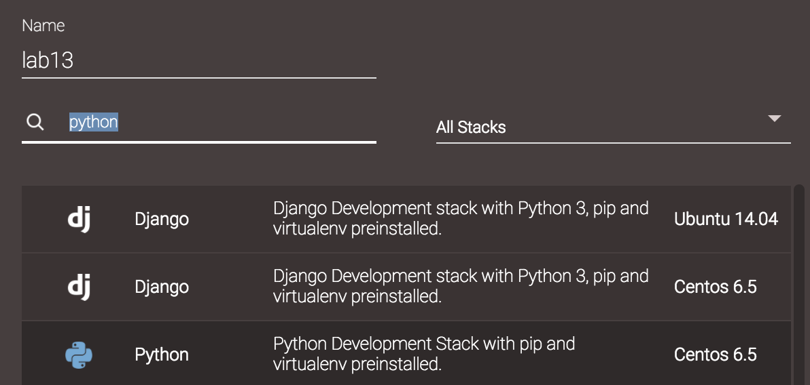

# Python

From this week, we'll start concentrating on Python. The ultimate aim is to build a dynamic website using Flask, based on all previous things you've learned so far. That is HTML/CSS/JavaScript/Bootstrap, and on top of it, Python-based Flask operating templates and an SQLite database.

This week's labs split into three sections. Depending on your proficiency of the language, you might want to skip some of them and continue working on your own website.

## You should know some Python already

Python is huge. But we don't have to know them all to get started on Flask. Here is a list of the things you'll need:

* First Steps and First Mistakes
* Taking Control
* Importing and Iteration
* Professional Functions
* Recursion
* Working with Data
* Dealing with Errors
* Encapsulation
* Inheritance
* Paradigms and Languages

Looks familiar? The truth is the list is from Matthew England, the module leader of 121COM. This is what you've learned in that module. We'll need everything in this list, and a little bit more.

This module assumes that you know Python already. To recall what you have learned, the best way is to find your own notes and read.

If you are exchange students who haven't done much Python, or you did 121COM but it feels like it's ages ago, you need to start from the very beginning. Choose the approach that suits you the best:

* You can find plenty online tutorials. Personally I found the following particularly useful. ['A Quick, Painless Tutorial on the Python Language'](http://heather.cs.ucdavis.edu/~matloff/Python/PythonIntro.html), written by Professor Norman Matloff at UC Davis. Unfortunately, the website is not being actively maintained. But in the module repository, you can find a pdf version.
* If you prefer interactive learning, you can use [Codecademy](https://www.codecademy.com/learn/python) or [Learnpython](http://www.learnpython.org/).

Either way, make sure your Python level goes back to where you left off.

## Some useful tools

### Virtual environments

Python is very popular. A by-product of this popularity is that it has many different packages, that depend on different versions of the language and different versions of other packages. This is like a chain reaction.

> Probably due to the popularity of Python, its creator [Guido Van Rossum](https://en.wikipedia.org/wiki/Guido_van_Rossum) got a good offer from Google. But later on, he got a even better one from Dropbox in 2012. 

As an example of this really bad situation, have a look at a popular Python library called [Biopython](http://biopython.org/wiki/Download) (used mainly for bioinformatics analysis) below. Depending on the version of Python language, a single release of Biopython has around 10 different flavors. Also, Biopython relies on [NumPy](http://www.numpy.org/), which is used for numerical analysis and which doesn't live in a vacuum. So you can imagine the situation can get really bad.


A remedy to this is to use virtual environments. A Virtual Environment is a tool to keep the dependencies required by different projects in separate places, by creating virtual Python environments for them.

> If you use Codeanywhere, to do the following exercises, you'll need to create a container based on Python Centos 6.5 stack. For this module, we don't use Python 3 as it's [not quite compatible with some modules](http://flask.pocoo.org/docs/0.12/python3/).

 

Go to terminal window, type in the following commands:

```bash
virtualenv venv
. venv/bin/activate
```

Commands above create a virtual environment and activate it. Now once activated, whatever you install will be installed in this virtual environment.

> Don't forget the leading `.` at the second line, this means the current folder. An alternative to this is the `source` command, click [here](http://superuser.com/questions/46139/what-does-source-do) for more details.

Type the following command to leave the virtual environment.

```bash
deactivate
```

### A Python web server

You learned Apache2. That's the proper production server you can use in any occasion. If you just need a simple server for development purposes, you can use Python module SimpleHTTPServer.

In terminal, type the following command and hit enter

```bash
python -m SimpleHTTPServer 8080
```

Now if you create an HTML file, you should be able to view it in a browser window. For example, I have an HTML file named test.html, and it's at address https://lab15-jianhuayang.c9users.io/test.html


> See more examples of SimpleHTTPServer on [here](http://www.linuxjournal.com/content/tech-tip-really-simple-http-server-python).

## Basic Flask

In last week's lab sheets, I didn't show you how to install `virtualenv`, as at that time it's installed in all virtual machines on C9 by default. But it seems that the default settings have been changed since then. In other words, `virtualenv` and `ipython` are not installed by default. We'll have to start from there.

> I use the Flask built-in web server in all examples. However, this server is not for production environment. For that, you'll need to use something such as [Apache module mod_wsgi](http://flask.pocoo.org/docs/0.10/deploying/).

### Installation

Open a terminal window on the C9 workspace, and issue the following command `which virtualenv`. If what you see is similar to below, that means the binary (software) is not installed. You'll need to install it first of all.


Use the following command to install `virtualenv`

```bash
sudo pip install virtualenv
```

Once done, run the following to create a virtual environment called 'venv'. This step repeats from the previous lab.

```bash
virtualenv venv
```

Next, run the following to activate the newly created virtual environment, and install flask in it.

```bash
. venv/bin/activate
pip install flask
```

If everything goes well, you'll see that some new folders appear in your `venv/lib/site-packages/` folder, including several that begins with the work flask.


The installation is now complete.

### Hello World!

The tradition in teaching programming language is to start with a 'Hello world' program. We'll do the same.

Create a new file called 'hello_flask.py' in your workspace, and insert following lines into it.

```python
from flask import Flask
import os

app = Flask(__name__);

@app.route('/')
def hello_world():
    return 'Hello World!'

if __name__ == '__main__':
    app.debug = True
    port = int(os.getenv('PORT', 8080))
    host = os.getenv('IP', '0.0.0.0')
    app.run(port=port, host=host)
```

We'll come back to this file later. Now go into the terminal and issue the following command `python hello_flask.py`, what you'll see is similar to below


Now you have a server listening on port 8080. But we don't know the IP address! If you click the 'Share' icon at the top-right corner, a small window will pop up. Copy the 'Application' URL, that's the address you need. 


Paste that URL into a new browser tab, what you'll see is similar to below


Congratulations, your first Flask website is up and running!

Now go back to the code we inserted into the file. There are several important concepts in it:

* `Flask` is a class, it accepts several different input parameters. The one we supplied is the name of the current module. This name is used to uniquely identified the currently running app.
* Line begins with `@` is called a decorator. This is used to modify the function (in the current case 'hello_word()'.) The modified function then becomes associated with route `/`, so that when a request is being sent to `/` i.e. the root folder of the website, this function will be run.
* The function is called a view function. In this example, the function returns a simple string. This string is internally cast into a response object, which is then returned by the server.
* The statement `__name__ == '__main__'` tests if the current file is being executed or being imported. If it's the former, this statement will evaluate to `True` and we'll run the app on specified IP address and port.

Note here PORT is an environment variable, it can be displayed in your terminal using

```bash
echo $PORT
```

Here port 8080 and IP address is required by C9, see [here](https://docs.c9.io/docs/run-an-application). If you use a different platform, it may be different. For example, running 'hello_flask.py' on my Mac using default options gives us `http://127.0.0.1:5000`


## Notes on the official Flask tutorial

On the official Flask website there's a [tutorial](http://flask.pocoo.org/docs/0.10/tutorial/). You can follow instructions there and see how far you can go. Don't worry if you don't completely understand, we'll cover them all in the next 2/3 weeks time. Bear in mind this tutorial is written in a very casual style. In your final submission, you want to avoid things like this:

* In step 1, a column of `primary key autoincrement` was created. However, in SQLite, we don't normally (that is DON'T) declare 'autoincrement', see [here](https://www.sqlite.org/autoinc.html) the official documentation.
* In step 1, SQL keywords should have been capitalized.
* In step 6, some tags weren't used properly. For example, HTML in doctype should be capitalized; `strong` tag should be avoided and use CSS to [achieve richer effect](http://www.w3schools.com/tags/tag_strong.asp).
