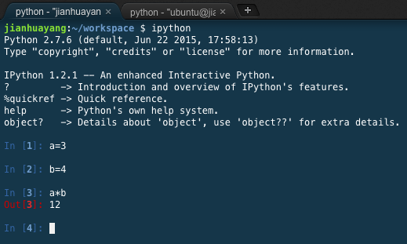

# Python

From this week, we'll start concentrating on Python. The ultimate aim is to build a dynamic website using Flask, based on all previous things you've learned so far. That is HTML/CSS/JavaScript/Bootstrap, and on top of it, Python-based Flask operating templates and an SQLite database.

This week's labs split into three sections. Depending on your proficiency of the language, you might want to skip some (or all) of them and get started on your own website.

## Basic syntax

I love Python, as much as you guys do in 110CT/121COM (even though I naturally speak Matlab). Python is huge. But we don't have to know them all to get you started on Flask. Here is a list of the things you need:

* First Steps and First Mistakes
* Taking Control
* Importing and Iteration
* Professional Functions
* Recursion
* Working with Data
* Dealing with Errors
* Encapsulation
* Inheritance
* Paradigms and Languages

Looks familiar? The truth is I talked to Matthew England, the module leader of 121COM. The list is what you've learned in that module. We'll need everything in it to get you started. And a bit more.

This module assumes that you know Python already. To recall what you have learned, the best way is to find your notes (you have them, right?) and read. Or you can go back to Moodle to download the material.

If you are exchange students who haven't done much in Python, or you did 110CT/121COM but it feels like it's ages ago, you need to start from the very beginning. Choose an approach that suits you the best:

* You may find some online PDF tutorials if you're a book lover. Among the many books I've read on Python, I found the following particularly useful. ['A Quick, Painless Tutorial on the Python Language'](http://heather.cs.ucdavis.edu/~matloff/Python/PythonIntro.html), written by Professor Norman Matloff at UC Davis. Unfortunately, the website is not being actively maintained. But in the module repository, you can find a pdf version. The document is copyright free for educational purposes, let me know if I'm wrong. (OK, I lied. This is the only book I've read properly on Python.)
* Or, if you prefer interactive learning, you can use [Codecademy](https://www.codecademy.com/learn/python) or [Learnpython](http://www.learnpython.org/).

Either way, make sure your Python level goes back to where you left off.

## Useful tools

### IPython 

[IPython](http://ipython.org/) is a useful tool developed by a bunch of researchers at UC Berkeley. I use it mainly as a replacement of the standard Python shell, but it offers a lot of features.

Open a new workspace in C9, and in the terminal window type `ipython` you'll see that IPython is installed by default. Type in the following commands and observe that IPython provides a better user experience.



If you use the standard Python shell instead, the output is this.


Another useful feature is auto-completion. Create a new variable called `areallylongviarable` and assign a value of 0. The next time you call it, type `are` + `Tab`, the shell will auto-complete the variable name for you.


### Virtual environments

Python is very popular. A by-product of this is that it has many different packages, that depend on different versions of the language and different versions of other packages. This is like a chain reaction.

> Probably due to the popularity of Python, its creator [Guido Van Rossum](https://en.wikipedia.org/wiki/Guido_van_Rossum) got a good offer from Google. But he, later on, got a even better one from Dropbox in 2012. 

As an example of this really bad situation, have a look at a popular Python library called [Biopython](http://biopython.org/wiki/Download) (used mainly for bioinformatics analysis) below. Depending on the version of Python language, a single release of Biopython has around 10 different flavors. Also, Biopython relies on [NumPy](http://www.numpy.org/), which is used for numerical analysis and which doesn't live in a vacuum. So you can imagine the situation can get really bad.


A remedy to this is to use virtual environments. A Virtual Environment is a tool to keep the dependencies required by different projects in separate places, by creating virtual Python environments for them.

Go to terminal window, type in the following commands:

```bash
virtualenv venv
. venv/bin/activate
```

Commands above create a virtual environment and activate it. Now once activated, whatever you install will be installed in this virtual environment.
> Don't forget the leading `.` at the second line, this means the current folder. An alternative to this is the `source` command, click [here](http://superuser.com/questions/46139/what-does-source-do) for more details.

Type the following command to leave the virtual environment.

```bash
deactivate
```

### A Python web server

You learned Apache2. That's the proper production server you can use in any occasion. If you just need a simple server for development purposes, you can use Python module SimpleHTTPServer.

In terminal, type the following command and hit enter

```bash
python -m SimpleHTTPServer 8080
```

Now if you create an HTML file, you should be able to view it in a browser window. For example, I have an HTML file named test.html, and it's at address https://lab15-jianhuayang.c9users.io/test.html


> See more examples of SimpleHTTPServer on [here](http://www.linuxjournal.com/content/tech-tip-really-simple-http-server-python).

## Flask tutorial (N.B.: advanced)

If you reach this point, congratulations you've successfully recalled the Python language!

What you can do now is that you either start working on your own website, i.e. the HTML/CSS/JS part, or you can start to look into Flask.

If you choose the latter, on the official website there's a [tutorial](http://flask.pocoo.org/docs/0.10/tutorial/). Follow instructions there and see how far you can go. Don't worry if you don't completely understand, we'll cover them all in the next 2/3 weeks time. Bare in mind this tutorial is written in a very casual style. In your final submission, you want to avoid things like this:

* In step 1, a column of `primary key autoincrement` was created. However, in SQLite, we don't normally (that is DON'T) declare 'autoincrement', see [here](https://www.sqlite.org/autoinc.html) the official documentation.
* In step 1, SQL keywords should have been capitalized.
* In step 6, some tags weren't used properly. For example, HTML in doctype should be capitalized; `strong` tag should be avoided and use CSS to [achieve richer effect](http://www.w3schools.com/tags/tag_strong.asp).
