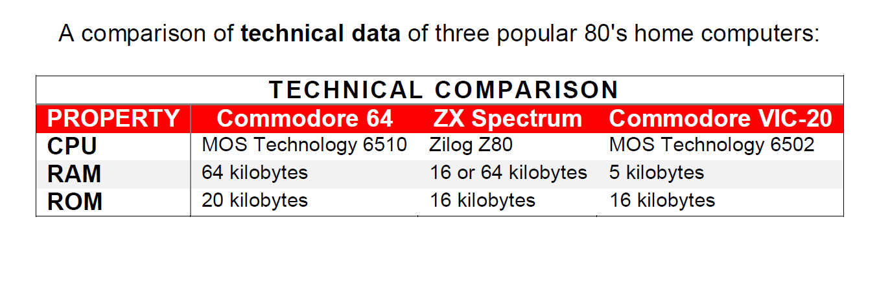

# Introduction to CSS3

In this lab you learn to use CSS3 for defining the visual outlook of a web site.

As you know by now, the purpose of HTML is to define the structure and content of a web site. It is not intended to contain any representational markup. CSS (Cascaded Style Sheets) is designed for that purpose.

This lab focuses on basic repsetentation (colors, fonts, etc.). The layout of the elements in a web page will be covered in the next lab.

From now on, we use CSS as a synonym for CSS3, which is the newest version of the styling language.

## Task list

In the lab you do the following tasks:

1. Perform basic formatting (colors, fonts, etc.) of your web pages.
1. Use CSS classes and identifiers to pick the correct elements 
1. Fine-tune your selection by picking nested elements
1. Use CSS box model to define the appearance of your web pages.
1. Position elements within a web page.
1. Use Bootstrap to quickly design responsive web sites.

This lab takes approximately 3 hours.


## 1 Style sheet basics

The purpose of a style sheet is to collect all information on how the pages in a web site should be visually rendered, into one place.

Ideally, all web pages in a site should be linked into one style sheet (one CSS file) that contains all visual formatting rules for the entire web site.

This approach makes a clear separation between content and representation. The approach makes it easy to get a uniform outlook for the entire site. Moreover, one can easily build alternative views that may be strikingly different visually yet they share the same content.


### Creating and linking a style sheet

Create a new file in Cloud9 and name it **simple.css**.

In the resulting CSS file, replace the placeholder content with the following:
```css
body {
    font-family: Arial, Verdana, sans-serif;
}

h1, h2 {
    color: blue;
    font-weight: bold;
}
```

Examine the CSS file and verify that you understand its contents. Pay attention to the following points:
- The file contains two rules. Each rule begins with the list of elements it has an effect on. The first rule is applied to the `body` element whilst the second rule is applied to `h1` and `h2` header elements.
- Followed by the element names (called selectors), there is a block starting with `{` and ending with `}`. This block contains a list of properties.
- The first rule (applicable to the `body` element) contains one property for setting the font.
- The second rule (applicable to major headers) contains two properties, one for setting blue font color and the other for bold text.
- The rules are automatically in effect in the nested subelements, so the font setting for `body` element applies to all elements in the page, including headers, lists, and paragraphs. 
- The fonts are given as a list of alternatives. The browser uses the first font in the list that it is capable of. The list should always end in a generic font such as `serif` or `sans-serif`.

Even though the CSS file is present, it has no effect as it is not currently linked to any HTML document.

The next step is to link it to the file **csstest.html** in the lab folder. First, open the file and see how it looks like without the CSS file. The browser now uses its default stylesheet for displaying the page.

Then, insert the following line of HTML code in the `head` element of the HTML file:

```
<link href="css/simple.css" type="text/css" rel="stylesheet" />
```

The line links the HTML file to the just created CSS file.

The link can be added before or after the `title` element, as the order of elements within `head` element is not important.

Having added the link, reload the web page and see how the rules are applied to the page.

Next, play with the CSS file. Add new rules and properties to the file and see how they affect the web page. Note that your IDE may help you in writing the contents of a CSS file by proposing property names and values as you type.

You can find a complete list of CSS property names and possible values (among other information) at the [W3C Cascading Stylesheets documentation](http://www.w3.org/TR/CSS/).

### Colours

In the example above, the colours of certain elements were set.

This can be done in two ways:
- using colour words ("red", "blue", etc.)
- using RGB colour values.

In RGB colour system, each colour is encoded as a combination of three bytes (valued 0 to 255), corresponding to red, green, and blue channels. For instance, bright red is (255,0,0) and royal blue is encoded (65,105,225).

Thus, valid ways to set the `h1` colour would be:
```css
h1 {
    color: blue;
}
```

or

```css
h1 {
    color: rgb(65,105,225);
}
```

In CSS3, RGB colours can be supplemented by an additional alpha channel, which sets the opacity value (0.0 meaning fully transparent and 1.0 fully opaque).

To add some opacity to headers, the aforementioned rule would be:
```css
h1 {
    color: rgba(65,105,225,0.7);
}
```


### Font sizes and measurements

Add the following lines of code to **simple.css** to change the font sizes:

```css
h1 {
    font-size: 4.0em;
}

ul, ol {
    font-size: 0.8em;
}
```

This sets a large font size for the first-level headers and a smaller than normal size for unordered and ordered lists.

In the previous example, you probably noticed that some properties (such as `font-size`) require you to set sizes . CSS provides alternative ways to specify sizes:


| Unit | Type     | Meaning                                                  |
|------|----------|----------------------------------------------------------|
| em   | relative | multiplier of the default font size (letter 'm' width).  |
| %    | relative | percentage of default font size.                         |
| px   | absolute | number of on-screen pixels.                              |
| pt   | absolute | Amount in points. A point equals to 1/72 of an inch.     |

The percentage unit has different meanings in other contexts. For fonts, it is advisable to use relative units. This is due to the fact that users may have set a different default font size because of vision problems, for example.

Play with the measurements and see how the web page is affected.

### Validation

Just like HTML5 files, CSS files should be validated using the [W3C CSS Validation Service](https://jigsaw.w3.org/css-validator/).

Validation makes sure that your CSS file complies with the CSS syntax. It may also help you to spot errors in the CSS file.

Go to the validation page, and validate the file you created. If no errors are found, introduce some on purpose and see how the validator reports them.


### Test your understanding

You need the aforementioned file `simple.css`.

Using the CSS documentation, make the following amendments to the CSS file:
- Add a border around each list and change the color of list items to dark grey. 
- Indent the paragraphs and lists.
- Make figure captions smaller and use bold face.
- Set a background color for the page.
    

## 2 Classes and identifiers

So far, the rules in the CSS file have been applied to all elements matching one of the selectors. For example, all paragraphs have automatically had the same looks.

It is possible to create a separate outlook for some instances of a given element by using classes or selectors.
- Classes can be applied to multiple instances of an element. These instances can also be a mixture of various element types, such a paragraphs (`p`) and first-level headers (`h1`).
- Identifiers are unique to each instance.


### Classes

An instance of an element is assigned to a class by entering a class attribute in the corresponding start tag in the HTML file.

Enter the following line of markup into **csstest.html**:

```html
<p class="copyright_notice">Photo courtesy of Pekka Virtanen.</p>
```

In the CSS file, assign a rule for paragraphs belonging to copyright\_notice class:
```
p.copyright_notice {
    font-size: 0.8em;
}
```

The rule is now applied to only those paragraphs that belong to `copyright_notice` class. There can be many such paragraphs, each having a similar `class` attribute. Verify this in browser.

Alternatively, you could create a rule for all elements in `copyright_notice` class, regardless of whether they are paragraphs, list items, or something else:
```css
.copyright_notice {
    font-size: 0.8em;
}
```

An HTML element can belong to multiple classes simultanously:
```html
<p class="info urgent">The tour starts at 10 am.</p>
```

The paragraph element above belongs to two classes: `info` and `urgent`.

### Identifiers

As seen before, multiple elements can belong to the same class. However, unique identifiers are a better option to generate rules that are applied only once.

This is marked in HTML by the identifier attribute:
```html
<p id="special">This is different from all other paragraphs</p>
```
The CSS rule looks as follows:
```css
#special {
    font-size: 0.8em;
    color: yellowgreen;
    font-style: italic;
    border-left: 2px solid black;
    margin-left: 40px;
    padding-left: 10px;
}
```

Add the paragraph and the corresponding rule in your files and verify the outcome.

Alternatively, you could use `p#special`, but - since there cannot be another special element that is not a paragraph - this would result in the same outcome.


Now, open file **selectors.html** and the associated style sheet **selectors.css** to play with classes and identifiers.

In the file, there are five paragraphs (`p`) and one header (`h1`). Verify that you understand the following:

- The first and the second paragraphs are regular paragraph elements (start tag `<p>`). For these paragraphs, standard rules for `p` elements are applied.
- The third and the fifth paragraphs are assigned a common class name (start tag `<p class="alert">`). For these paragraphs, standard rules for paragraphs are applied. In addition, rules for all `alert` class elements (`.alert`) are applied as well as those rules that are specific to paragraphs belonging to alert class (`p.alert`).
- The fourth paragraph is supposed to have a unique formatting. Thus, it is assigned an identifier (start tag `<p id="unique">`). For this paragraph, standard paragraph rules plus rules specific to this identifier (#unique) apply.
- The header belongs to `alert` class like two of the paragraphs. It is affected by a rule that is targeted to all elements of `alert` class (`.alert`). In addition, all rules for `h1` would be applied but there is none.
- The rule for `body` element is applied to all elements as they are nested elements inside the body element.

If a property of an element would be defined in multiple CSS rules, the rule whose selector has highest specificity wins. For instance, the properties defined in a class-specific rule override the attributes defined in the general rule for the element.


### Test your understanding
1. Modify the **selectors.html** and **selectors.css** files so that the first, third, and fifth paragraph appear underlined (in addition to the existing formatting). You should achieve this with a single CSS rule.

2. In **csstest.html** file, add a paragraph about Basic programming to the bottom of the page (Basic was a common language for programming 80's home computers). Below the paragraph, add a sample program as below:
    ```
    10 PRINT "Hello, World"
    20 INPUT "Continue (y/n)?", R$
    30 IF R$="y" THEN GOTO 10
    ```
    Find the proper markup for doing this. Include the necessary CSS rule(s) to get a pleasant outcome. Validate your work.

3. Open the file **comparison.html** containing the comparison table of three computers. Create a new CSS file and link it to the HTML file. Generate the contents of the CSS file to make the HTML table resemble the image **comparison.png** in the lab's **img** folder as accurately as possible. Validate.


## 3 Fine-tuning the rules

In this part, we look at various ways to modify the CSS rules. The selections can be applied to elements in a specific context such as inside a specific element. Furthermore, pseudoelements allow selection of only the first row or character inside the content, for example.

Finally, we look at the options for placing CSS.

### Selecting the elements

So far, we have used elements, classes and identifiers to pick the applicable rules.

It is possible to define the targets of rules in a more specified way. Open file **targets.html** to demonstrate this. In the file, there's a complex list structure.

The file is linked to **targetstyles.css**, which contains only the font settings for the entire document.

Write the following rules to **targetstyles.css**:

```css
ol > li {
    color: green;    
}

ul li ul {
    font-weight: bold;
}

ul li ul li ul {
    color: blue;
}
```

As the HTML file contains several list elements, nested and unnested, we can't to make the correct elements as targets of the rules using a single element as a selector. However, CSS provides a straightforward way to achieve our goal.

- In the first rule, selector `ol > li` matches only those `li` elements that are direct children of the unordered list.
- In the second rule, those unordered lists are selected that appear in list items of a higher-level unordered list. Note that this rule applies to both the second and the third levels of the nested list in the example.
- The third rule applies only to the third level (and potential deeper levels) in nested unordered lists.


### Nested elements and pseudoelements

Pseudoelements allow formatting only certain parts of an element. Using pseudoelements, it is for instance possible to pick the first letter or line of a paragraph.

Add the following line into **simple.css** (that is linked to **csstest.html**):

```css
p::first-letter {
    font-size:8em;
}

p::first-line {
    font-weight: bold;
}
```

Reload the page in browser and see the changes.

In pseudoelement notation, a double colon (`::`) appears after the element name. This precedes one of the following: `after`, `before`, `first-letter`, `first-line`, or `selection`.

The first two (`after` and `before`) are normally used with `content` property to insert new representational content.

### Location of CSS

In all the examples above, the CSS rules have been located in a single CSS file. It is the best place for CSS rules from modularity's point of view. 

Technically, there are other options for placing CSS rules, even though they are considered bad practice.

The first alternative is to make CSS inline:
```html
<p style="color: green">Hello!</p>
```

The second alternative is to generate a page-specific internal stylesheet inside the `head` element of an HTML document:
```html
<head>
  <style>
    p {color: green};
  </style>
</head>
```

As these approaches obscure the separation of content and presentation, their use is discouraged. It may, however, be useful to recognize them, as they are sometimes used.


# Responsive layout with CSS and Bootstrap

In this lab you learn to create a responsive layout for a web page or a web site.

You first learn the basics of positioning elements to create a unified layout. The positioning is done using CSS, based on proper markup of elements using HTML. In addition to the positioning of the elements, you learn to design the navigation and create a multi-level menu for your web site.

The goal is to build responsive websites, i.e. sites that scale well when viewed by various devices such as dekstop and mobile devices. The responsiveness of a web page is achieved by using Bootstrap framework.


## 4 CSS Box model

First, open the file **boxmodel.html** that illustrates the CSS box model which is vital for understanding how to set the dimensions, margins and paddings of elements in a web page. Check the contents of the file. You notice that it contains four paragraph elements, each labeled to belong to a different class.

Create a file called **boxstyles.css** and link it to the HTML file.

In the newly-created CSS file, add the following lines of code:
```css
p.one {
    border: 1px solid black;
    padding: 3em;
    margin:  1em;
    margin-bottom: 0em;
}
```

This sets the visual appearance for the first text paragraph that belongs to class `one`. Reload the page and see how the paragraph is affected.

To truly understand the lines of code above, it is important to get an idea of the CSS box model.

The box model is applicable to block elements, i.e. elements that  hold a rectangular space in the screen. Recall that common HTML elements such as headers, paragraphs, and lists are block elements.

For each element, you can set various CSS properties, such as:
- `border`: the thickness and looks of the border outlining the element
- `margin`: the amount of free space outside the border
- `padding`: the amount of free space inside the border

Notice that borders are normally invisible for most elements (such as regular paragraphs). In spite of this, you can use margin and padding settings in the normal way.

By default, the settings above apply to all four directions. In the example above, the margin setting was overridden for the bottom direction.

Now, add rules for the remaining paragraph classes (two, three, four) to generate the following appearance for the remaining paragraphs:
- class `two`: same border as for class `one`, no padding, 5em margins except for the top where no should be no margin.
- class `three`: a 3 pixels wide solid black border only in the left edge of the paragraph, 1em padding except for the top where no padding is applied, 2em top margin, 8em bottom margin, no left and right margins.
- class `four`: a 5 pixels wide dashed red margin with rounded corners (1em radius).

Verify that all four paragraphs are displayed exactly as intended.

### Tracking layout problems

In Google Chrome browser, there's a built-in feature for viewing the layout of an individual element. It is an important tool for finding and correcting layout problems.

You can simply right-click on an element and select **Inspect element**. Try it for each differently-formatted paragraph in your page.


### Test your understanding

1. The file **box_assignment.png** in the lab's `img` folder contains an image of intended appearance for a web-page. Using CSS box model, construct an HTML page and the associated CSS file that reproduce the appearance of the image.

    Note: in the lab's **img** folder, you also find the public domain image **berries.png** (author Scott Bauer, via http://commons.wikimedia.org) needed in the assignment. 
    
    


## 5 Positioning of elements

So far, we have modified the way how individual elements look and how much space should be left inside or outside the margin.

Next, you learn how to modify the position, width and height of a block element. As a result, you will be able to generate exactly the desired layout for your web page.

There are three positioning schemes in CSS:

1. Normal flow of positioning
2. Floating positioning
3. Absolute positioning


So far, we have used normal positioning where elements are stacked on top of each other in the order they appear in the HTML file.

Next, let's take a look at the alternative positioning schemes.

### Floating positioning

A floating element is an element whose location in the web page is treated in a special way, so it is removed from the normal flow of positioning. The remaining elements in the page are rendered so that they wrap around the floating element.

Floating positioning is common for figures. A floating image can be positioned in the desired location on the page, and any surrounding text paragraphs and other elements can be set to surround the image nicely.

Open the file **floating.html** and view the HTML file as well as the linked CSS file **floatstyles.css**, located in the **css** directory.

The HTML file contains one image tag. First, add an identifier for the figure holding the image, as it is going to be treated in a different way compared to potential other figures in the document:

```html
<figure id="floating">

    <figcaption>Onions are delicious.</figcaption>
</figure>
```

Next, open the linked CSS file **floatstyles.css** and add the following rule:
```css
figure#floating {
    float: right;
}
```

Reopen the page in browser. The figure is now positioned in the right, together with the caption. The text wraps around the figure.

Next, we make a floating fact box that contains multiple elements. Add the following files in the HTML file **floating.html** right after the main heading, before any paragraphs:


```html
<section id="factbox">    
<p>Did you know?</p>
<ul>
    <li>The latin name for onion plant is <em>Allium Cepa</em>.</li>
    <li>Onions have been used in cooking for thousands of years.</li>
    <li>89% of onion's content is water.</li>
</ul>
</section> 

```

This time, the floating entity consists of two elements: a paragraph (`p`) and an unordered list (`ul`). Thus, we need a special container element that contains both the paragraph and the list. 

There are two alternatives for the container: either a generic `div` element, or a more semantic `section` element. As the header and the list in the fact box clearly form a semantic entity, it is advisable to use the latter.

Now, add the rule for the `section` element whose identifier is `factbox`:

```css
section#factbox {
    float: left;
    border: 1px solid black;
    margin: 2em;
    padding: 1em;
}
```

Reload the page to see the effect of the modification. The fact box should appear bordered in the left side of the content, text wrapping around it.

Test, how the floating elements behave as you resize the window.


### Absolute positioning

The third positioning scheme is absolute positioning. In this scheme, an element's absolute position is given, usually in pixels or percentage.

Next, let's create navigation links for the onion page. Initially, we set the links to be located in accordance with the default flow of the elements. Then, we use CSS reposition the links into the top left edge of the screen.

Add the navigation information (using the HTML5 `nav` element) into the bottom of **floating.html** file, inside the body element:

```html
<nav>
  <a href="1.html">Nutrition</a> 
  <a href="2.html">Recipes</a> 
  <a href="3.html">Growing</a> 
  <a href="4.html">History</a>
</nav> 
```

Note that the files that the links point to do not exist. We could add them later.

Reload the page and see how the links are positioned by default.

To move the navigation items to the left edge , we use absolute positioning. Add the following rule for the nav element to the CSS file:
```css
nav {
    position: absolute;
    top: 120px;
    left: 40px;
    width: 100px;
}
```

This sets the absolute position of the element to be exactly 120 pixels from the top of the page and exactly 40 pixels from the left edge of the page. Furthermore, the width of the element is set to 100 pixels.

Note that the elements positioned using absolute positioning may appear on top of other elements, essentially garbling the output. To avoid this, we move the left edge of the page contents to 200 px, to facilite the 100 px wide navigation element, starting at 40 px. Modify the rule for `body` element to contain the new `margin-left` property:
```css
body {
    font-family: Arial, Verdana, sans-serif;
    margin-left: 200px;
}
```


### Test your understanding

1. Open file **columns.html**. Generate a style sheet **columnstyles.css** where the paragraphs are displayed in:
    a. two columns
    b. three columns
    
    Hint: search for CSS properties containing the word `column`. Currently, there are browser restrictions and inconsistencies in displaying multi-column content, but the workarounds are well documented. Try to take these into account in your CSS.
    
2. In Lab 3 (HTML5), you created a home page of fictional Jane or John Doe, or yourself (If you didn't do that lab, quickly generate a home page). Build a CSS file for the home page that displays the information in a nicely formatted fashion. Position the image as a floating element in either edge of the page.


## 6 Navigation

The next task is to build a navigation menu bar to the web site using CSS. Depending on the number of menu items, the menu bar can contain multi-level menus.

A menu bar is be defined as an HTML unordered list. Each menu in a menu bar is a list item.

The menus can contain submenus. A submenu is coded as a list that is within the parent menu's list item.

Open file **menu.html** as well as the linked CSS file in the **css** directory called **menustyles.css**.

Try the functionality of the two-level menu by hovering the mouse pointer over the **Item 1**, **Item 2**, and **Item 3** texts. The last two have submenus.

Examine, how the hierarchical menu was created using plain CSS. Note that the links are just dummies; they don't lead to any web pages. In the example, the barebones menu bar contains only minimum formatting that is necessary for correct layout.

Important things to note:
- List bullets are removed by setting `list-style: none`.
- Second-level list items are set, by default, hidden: `visibility:hidden`. 
- Whenever the mouse pointer hovers over the first-level list item, the second level list-item is set visible. The selector `nav ul li:hover > li` points to those `li` items that are descendants of `nav`, `ul`, and (one that a mouse hovers over) `li` elements.


## 7 Responsiveness and Bootstrap

Now that you are familiar with element positioning using CSS, we utilize Bootstrap framework that simplifies the design of a web site and makes it much easier to create sites that are responsive. (Recall that a responsive web site scales well into various devices, including mobile devices.)

Besides CSS stylesheets for responsive designs, Bootstrap includes some Javascript functionality. We ignore that for the time being and focus on the CSS usage.

### Linking to Bootstrap stylesheets

In this example, we design a web page for a fictitious computer game. First, open a HTML5 file called **game.html**.

In your HTML file, you notice links to the bootstrap CSS files that are included from a content delivery network (CDN). This is done by adding the following lines inside the head element of the HTML page:
```html
 <!-- Latest compiled and minified CSS -->
<link rel="stylesheet" href="https://maxcdn.bootstrapcdn.com/bootstrap/3.3.5/css/bootstrap.min.css">

<!-- jQuery library -->
<script src="https://ajax.googleapis.com/ajax/libs/jquery/1.11.3/jquery.min.js"></script>

<!-- Latest compiled JavaScript -->
<script src="https://maxcdn.bootstrapcdn.com/bootstrap/3.3.5/js/bootstrap.min.js"></script>
```

In the `head` element of **game.html**, there are some additional elements for character encoding and rendering information. 

### Adding content

Once the Bootstrap stylesheets are linked, you can start designing your content.

The overall layout is achieved using div elements that carry a specific class name. For instance, a responsive container for the content is created by adding the following lines in the `body`element:

```html
<div class="container">
  <h1>Space Escape</h1>
    <p>Space Escape is a text adventure game where Per Finn, the protagonist, dares to venture the uncharted realms of planet Mars. Be prepared for thrill and suspension!</p>
</div>
```

The class above, `container` is the main class for holding contents. Alternatively, class `container-fluid` can be used to get a full-width container.

Now, you can apply the grid model of bootstrap to divide the area below the previous element into three equally spaced columns, each having some content. Within the `container` element, add the following nested elements:
```html
 <div class="row">
     <div class="col-sm-4">
         <h2>Setup</h2>
         <p>Per Finn and his assistant have succesfully landed in Mars. As soon as the engines are turned off, there is a loud knock at the door of the outer airlock. Who could that be?</p>
     </div>
     <div class="col-sm-4">
         <h2>Characters</h2>
         <dl>
             <dt>Per Finn</dt><dd>Brave adventurer</dd>
             <dt>Urpo McMahon</dt><dd>Per's loyal assistant</dd>
         </dl>
     </div>
     <div class="col-sm-4">
         <h2>Hazards</h2>
         <ul>
             <li>Galactic reptiles</li>
             <li>Martian slime ponds</li>
             <li>Ashphyxia</li>
         </ul>
     </div>
</div>
```

Try the page in browser. Resize the window to emulate a mobile device.

Above, the grid model was specified by including three div-elements specifying class `col-sm-4`. In Bootstrap, the content area is split into 12 parts. Thus, for example, two equally wide elements would be obtained by class `col-sm-6`.

### Styling

Bootstrap has defined styles for HTML elements such as headings and paragraphs. Most elements can be further enhanced with CSS classes.

As an example, add add an image with rounded corners into an empty paragrap element in the main container:
```html
<p>

</p>
```

The class definition, `img-rounded` has the desired effect on the outlook of the image.

The available Bootstrap classes for various purposes can be best found using a reference.

For Bootstrap reference, use sources such as:
- W3Schools Bootstrap tutorial: http://www.w3schools.com/bootstrap/
- Tutorial Republic Bootstrap tutorial: http://www.tutorialrepublic.com/twitter-bootstrap-tutorial/
- Bootstrap home page: http://getbootstrap.com/

Add more content to the page and test the outcome in a browser. Test responsiveness by resizing the browser window and/or opening the page in a mobile device.

### Test your understanding

1. Add the following elements into the **game.html** page:
    - a well (a gray area with rounded edges), that contains facts about Mars.
    - home, previous and next buttons (functionality not required). Use pager class.
    


