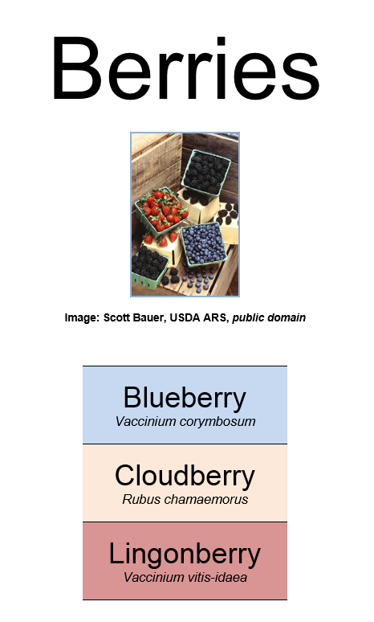

# Responsive layout with CSS

In this lab you learn to create a responsive layout for a web page or a web site.

Yuo first learn the basics of positioning elements to create a unified layout. The positioning is done using CSS, based on proper markup of elements using HTML. In addition to the positioning of the elements, you learn to design the navigation and create a multi-level menu for your web site.

The goal is to build responsive websites, i.e. sites that scale well when viewed by various devices such as dekstop and mobile devices. The responsiveness of a web page is achieved by using Bootstrap framework.


## Task list

In this lab you do the following tasks:

- Use CSS box model to define the appearance of your web pages.
- Position elements within a web page.
- Implement navigation functionality with CSS.
- Use Bootstrap to quickly design responsive web sites.

This lab takes approximately 2 hours.

## 1 CSS Box model

First, open the file **boxmodel.html** that illustrates the CSS box model which is vital for understanding how to set the dimensions, margins and paddings of elements in a web page. Check the contents of the file. You notice that it contains four paragraph elements, each labeled to belong to a different class.

Create a file called **boxstyles.css** and link it to the HTML file.

In the newly-created CSS file, add the following lines of code:
```css
p.one {
    border: 1px solid black;
    padding: 3em;
    margin:  1em;
    margin-bottom: 0em;
}
```

This sets the visual appearance for the first text paragraph that belongs to class `one`. Reload the page and see how the paragraph is affected.

To truly understand the lines of code above, it is important to get an idea of the CSS box model.

The box model is applicable to block elements, i.e. elements that  hold a rectangular space in the screen. Recall that common HTML elements such as headers, paragraphs, and lists are block elements.

For each element, you can set various CSS properties, such as:
- `border`: the thickness and looks of the border outlining the element
- `margin`: the amount of free space outside the border
- `padding`: the amount of free space inside the border

Notice that borders are normally invisible for most elements (such as regular paragraphs). In spite of this, you can use margin and padding settings in the normal way.

By default, the settings above apply to all four directions. In the example above, the margin setting was overridden for the bottom direction.

Now, add rules for the remaining paragraph classes (two, three, four) to generate the following appearance for the remaining paragraphs:
- class `two`: same border as for class `one`, no padding, 5em margins except for the top where no should be no margin.
- class `three`: a 3 pixels wide solid black border only in the left edge of the paragraph, 1em padding except for the top where no padding is applied, 2em top margin, 8em bottom margin, no left and right margins.
- class `four`: a 5 pixels wide dashed red margin with rounded corners (1em radius).

Verify that all four paragraphs are displayed exactly as intended.

### Tracking layout problems

In Google Chrome browser, there's a built-in feature for viewing the layout of an individual element. It is an important tool for finding and correcting layout problems.

You can simply right-click on an element and select **Inspect element**. Try it for each differently-formatted paragraph in your page.


### Test your understanding

1. The file **box_assignment.png** in the lab's `img` folder contains an image of intended appearance for a web-page. Using CSS box model, construct an HTML page and the associated CSS file that reproduce the appearance of the image.

    Note: in the lab's **img** folder, you also find the public domain image **berries.png** (author Scott Bauer, via http://commons.wikimedia.org) needed in the assignment. 
    
    


## 2 Positioning of elements

So far, we have modified the way how individual elements look and how much space should be left inside or outside the margin.

Next, you learn how to modify the position, width and height of a block element. As a result, you will be able to generate exactly the desired layout for your web page.

There are three positioning schemes in CSS:

1. Normal flow of positioning
2. Floating positioning
3. Absolute positioning


So far, we have used normal positioning where elements are stacked on top of each other in the order they appear in the HTML file.

Next, let's take a look at the alternative positioning schemes.

### Floating positioning

A floating element is an element whose location in the web page is treated in a special way, so it is removed from the normal flow of positioning. The remaining elements in the page are rendered so that they wrap around the floating element.

Floating positioning is common for figures. A floating image can be positioned in the desired location on the page, and any surrounding text paragraphs and other elements can be set to surround the image nicely.

Open the file **floating.html** and view the HTML file as well as the linked CSS file **floatstyles.css**, located in the **css** directory.

The HTML file contains one image tag. First, add an identifier for the figure holding the image, as it is going to be treated in a different way compared to potential other figures in the document:

```html
<figure id="floating">

    <figcaption>Onions are delicious.</figcaption>
</figure>
```

Next, open the linked CSS file **floatstyles.css** and add the following rule:
```css
figure#floating {
    float: right;
}
```

Reopen the page in browser. The figure is now positioned in the right, together with the caption. The text wraps around the figure.

Next, we make a floating fact box that contains multiple elements. Add the following files in the HTML file **floating.html** right after the main heading, before any paragraphs:


```html
<section id="factbox">    
<p>Did you know?</p>
<ul>
    <li>The latin name for onion plant is <em>Allium Cepa</em>.</li>
    <li>Onions have been used in cooking for thousands of years.</li>
    <li>89% of onion's content is water.</li>
</ul>
</section> 

```

This time, the floating entity consists of two elements: a paragraph (`p`) and an unordered list (`ul`). Thus, we need a special container element that contains both the paragraph and the list. 

There are two alternatives for the container: either a generic `div` element, or a more semantic `section` element. As the header and the list in the fact box clearly form a semantic entity, it is advisable to use the latter.

Now, add the rule for the `section` element whose identifier is `factbox`:

```css
section#factbox {
    float: left;
    border: 1px solid black;
    margin: 2em;
    padding: 1em;
}
```

Reload the page to see the effect of the modification. The fact box should appear bordered in the left side of the content, text wrapping around it.

Test, how the floating elements behave as you resize the window.


### Absolute positioning

The third positioning scheme is absolute positioning. In this scheme, an element's absolute position is given, usually in pixels or percentage.

Next, let's create navigation links for the onion page. Initially, we set the links to be located in accordance with the default flow of the elements. Then, we use CSS reposition the links into the top left edge of the screen.

Add the navigation information (using the HTML5 `nav` element) into the bottom of **floating.html** file, inside the body element:

```html
<nav>
  <a href="1.html">Nutrition</a> 
  <a href="2.html">Recipes</a> 
  <a href="3.html">Growing</a> 
  <a href="4.html">History</a>
</nav> 
```

Note that the files that the links point to do not exist. We could add them later.

Reload the page and see how the links are positioned by default.

To move the navigation items to the left edge , we use absolute positioning. Add the following rule for the nav element to the CSS file:
```css
nav {
    position: absolute;
    top: 120px;
    left: 40px;
    width: 100px;
}
```

This sets the absolute position of the element to be exactly 120 pixels from the top of the page and exactly 40 pixels from the left edge of the page. Furthermore, the width of the element is set to 100 pixels.

Note that the elements positioned using absolute positioning may appear on top of other elements, essentially garbling the output. To avoid this, we move the left edge of the page contents to 200 px, to facilite the 100 px wide navigation element, starting at 40 px. Modify the rule for `body` element to contain the new `margin-left` property:
```css
body {
    font-family: Arial, Verdana, sans-serif;
    margin-left: 200px;
}
```


### Test your understanding

1. Open file **columns.html**. Generate a style sheet **columnstyles.css** where the paragraphs are displayed in:
    a. two columns
    b. three columns
    
    Hint: search for CSS properties containing the word `column`. Currently, there are browser restrictions and inconsistencies in displaying multi-column content, but the workarounds are well documented. Try to take these into account in your CSS.
    
2. In Lab 3 (HTML5), you created a home page of fictional Jane or John Doe, or yourself (If you didn't do that lab, quickly generate a home page). Build a CSS file for the home page that displays the information in a nicely formatted fashion. Position the image as a floating element in either edge of the page.


## 3 Navigation

The next task is to build a navigation menu bar to the web site using CSS. Depending on the number of menu items, the menu bar can contain multi-level menus.

A menu bar is be defined as an HTML unordered list. Each menu in a menu bar is a list item.

The menus can contain submenus. A submenu is coded as a list that is within the parent menu's list item.

Open file **menu.html** as well as the linked CSS file in the **css** directory called **menustyles.css**.

Try the functionality of the two-level menu by hovering the mouse pointer over the **Item 1**, **Item 2**, and **Item 3** texts. The last two have submenus.

Examine, how the hierarchical menu was created using plain CSS. Note that the links are just dummies; they don't lead to any web pages. In the example, the barebones menu bar contains only minimum formatting that is necessary for correct layout.

Important things to note:
- List bullets are removed by setting `list-style: none`.
- Second-level list items are set, by default, hidden: `visibility:hidden`. 
- Whenever the mouse pointer hovers over the first-level list item, the second level list-item is set visible. The selector `nav ul li:hover > li` points to those `li` items that are descendants of `nav`, `ul`, and (one that a mouse hovers over) `li` elements.


### Test your understanding

1. Add a fourth menu with a few menu items to **menu.html**.

2. Use CSS to format the menu bar in the way that is shown in file **menu.png** in the lab's **img** folder.
    


3. Make one of the second-level menu items to contain a third-level menu. Make necessary amendments to the CSS file.

## 4 Responsiveness and Bootstrap

Now that you are familiar with element positioning using CSS, we utilize Bootstrap framework that simplifies the design of a web site and makes it much easier to create sites that are responsive. (Recall that a responsive web site scales well into various devices, including mobile devices.)

Besides CSS stylesheets for responsive designs, Bootstrap includes some Javascript functionality. We ignore that for the time being and focus on the CSS usage.

### Linking to Bootstrap stylesheets

In this example, we design a web page for a fictitious computer game. First, open a HTML5 file called **game.html**.

In your HTML file, you notice links to the bootstrap CSS files that are included from a content delivery network (CDN). This is done by adding the following lines inside the head element of the HTML page:
```html
 <!-- Latest compiled and minified CSS -->
<link rel="stylesheet" href="https://maxcdn.bootstrapcdn.com/bootstrap/3.3.5/css/bootstrap.min.css">

<!-- jQuery library -->
<script src="https://ajax.googleapis.com/ajax/libs/jquery/1.11.3/jquery.min.js"></script>

<!-- Latest compiled JavaScript -->
<script src="https://maxcdn.bootstrapcdn.com/bootstrap/3.3.5/js/bootstrap.min.js"></script>
```

In the `head` element of **game.html**, there are some additional elements for character encoding and rendering information. 

### Adding content

Once the Bootstrap stylesheets are linked, you can start designing your content.

The overall layout is achieved using div elements that carry a specific class name. For instance, a responsive container for the content is created by adding the following lines in the `body`element:

```html
<div class="container">
  <h1>Space Escape</h1>
    <p>Space Escape is a text adventure game where Per Finn, the protagonist, dares to venture the uncharted realms of planet Mars. Be prepared for thrill and suspension!</p>
</div>
```

The class above, `container` is the main class for holding contents. Alternatively, class `container-fluid` can be used to get a full-width container.

Now, you can apply the grid model of bootstrap to divide the area below the previous element into three equally spaced columns, each having some content. Within the `container` element, add the following nested elements:
```html
 <div class="row">
     <div class="col-sm-4">
         <h2>Setup</h2>
         <p>Per Finn and his assistant have succesfully landed in Mars. As soon as the engines are turned off, there is a loud knock at the door of the outer airlock. Who could that be?</p>
     </div>
     <div class="col-sm-4">
         <h2>Characters</h2>
         <dl>
             <dt>Per Finn</dt><dd>Brave adventurer</dd>
             <dt>Urpo McMahon</dt><dd>Per's loyal assistant</dd>
         </dl>
     </div>
     <div class="col-sm-4">
         <h2>Hazards</h2>
         <ul>
             <li>Galactic reptiles</li>
             <li>Martian slime ponds</li>
             <li>Ashphyxia</li>
         </ul>
     </div>
</div>
```

Try the page in browser. Resize the window to emulate a mobile device.

Above, the grid model was specified by including three div-elements specifying class `col-sm-4`. In Bootstrap, the content area is split into 12 parts. Thus, for example, two equally wide elements would be obtained by class `col-sm-6`.

### Styling

Bootstrap has defined styles for HTML elements such as headings and paragraphs. Most elements can be further enhanced with CSS classes.

As an example, add add an image with rounded corners into an empty paragrap element in the main container:
```html
<p>

</p>
```

The class definition, `img-rounded` has the desired effect on the outlook of the image.

The available Bootstrap classes for various purposes can be best found using a reference.

For Bootstrap reference, use sources such as:
- W3Schools Bootstrap tutorial: http://www.w3schools.com/bootstrap/
- Tutorial Republic Bootstrap tutorial: http://www.tutorialrepublic.com/twitter-bootstrap-tutorial/
- Bootstrap home page: http://getbootstrap.com/

Add more content to the page and test the outcome in a browser. Test responsiveness by resizing the browser window and/or opening the page in a mobile device.

### Test your understanding

1. Add the following elements into the **game.html** page:
    a. a well (a gray area with rounded edges), that contains facts about Mars.
    b. home, previous and next buttons (functionality not required). Use pager class.
    