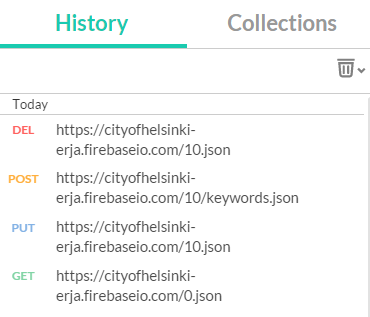

# RESTful APIs

In this lab you learn the basics of RESTful APIs. REST has become one of the most important technologies for Web applications.
Every major development language now includes frameworks for building RESTful Web services. 
Also CodeIgniter has also nowadays a RESTful server implementation. We will discuss this later on section 17.

REST stands for Representational State Transfer, which is an architectural style used to build Web services that are lightweight, maintainable, and scalable. 


## Task list

In the lab you do the following tasks:

1. Use existing published REST APIs
2. Write a mash-up combining existing REST API's results
3. Write your own REST API.

This lab takes at least 2 hours.


## 1 REST architectural style

### Application as a resource provider

We can think of every system as a system using resources. These resources can be pictures, video files, 
Web pages, business information, or anything that can be represented in a computer-based system. 
The purpose of a service is to provide access to these resources. 

A RESTful service is stateless and does not maintain the application state for any client. 
A request cannot be dependent on a past request and a service treats each request independently. 
HTTP is itself a stateless protocol by design. 


### Requiring resources

REST requires each resource to have at least one URI. 
A RESTful service uses a directory hierarchy like human readable URIs to address its resources. 
The job of a URI is to identify a resource or a collection of resources. 
The actual operation is determined by an HTTP verb. The URI should not say anything about the operation or action. 
This enables us to call the same URI with different HTTP verbs to perform different operations.

Suppose we have a database of persons and we wish to expose it to the outer world through a service. 
A resource person can be addressed like this:

http://MyService/Persons/1

### HTTP methods used

You have seen GET and POST methods used, but a RESTful style is  to use all HTTP methods, and to use of them in
a consistent way.

Method |	Operation performed on server | Quality
| --------|---------|-------|
GET |	Read a resource. |	Safe
PUT |	Insert a new resource or update if the resource already exists. |	Idempotent
POST |	Insert a new resource. Also can be used to update an existing resource. |	N/A
DELETE	 | Delete a resource .	 | Idempotent
OPTIONS |	List the allowed operations on a resource.	 | Safe
HEAD |	Return only the response headers and no response body. |	Safe

A Safe operation is an operation that does not have any effect on the original value of the resource. 

An Idempotent operation is an operation that gives the same result no matter how many times you perform it.

An example of an HTTP request to put a new character in the Persons database.
```
POST http://MyService/Person/
Host: MyService
Content-Type: application/json
Accept: application/json
{
    "id": 1,
     "Name": "Harry Potter",
     "Email": "harry.potter@hogwarts.magic",
     "From": Book
}
```

## 2 Using REST API

API stands for Application Programming Interface - it means that we give access to public methods of an application outside of the program itself. 
To allow this action to take place, the application has to publish an API that specifically allows for 
foreign applications to make calls to its data and return data to the user from inside of the external application. 

Let's familiarise ourselves with a demo implementation of a REST API. One such is located in an URL address

http://reqres.in/

If you scroll to the "give it a try" header you'll see buttons on the left, an API request part in the middle and a response on the right. You may
try different requests freely by pushing any button.

We can make our experiments using a Chrome browser plugin called Postman as well. If it’s not installed on your computer, do it now.


The requests we have are the ones which are shown in Postman history. (If you really see the pictures below, you'll find out that experiments use an different URL but otherwise pictures are informative.)

.

### Making queries with Postman

By choosing a GET method at the left-hand side and requesting for the first issue in the URL, we have 


.


The PUT method is used to add a named resource. we will have to give the item we want to add in the request. By choosing PUT at the left hand side, giving URL and adding the json data to the request body as raw data in JSON format, we will have

.


.

The POST method is used to add a new item to a collection. These are represented as arrays in our data and the keywords is such an array. By choosing POST at the left hand side, giving URL and adding the string to the request body as raw data in Json or Text format, we will have

.

Finally we have DELETE method which is used to remove resources and collections. By choosing POST at the left hand side and giving URL and the issue, we will have

.

### Using public API


Try the next two requests in Postman. 
One for Google Maps API for getting coordinates for a location, another for Instagram to pull images from Instagram API using the coordinates. 
Instagram like some other APIs need authentication. For public API's you may want to have a look at

https://www.avoindata.fi/data/fi/dataset?res_format=json&_res_format_limit=0

The requests are e.g.

https://maps.googleapis.com/maps/api/geocode/json?address=helsinki, fi

and

https://api.instagram.com/v1/media/search?lat=60.1788737%lng=24.9570322


Next take a look at the following code, which is a small application called mashup, which refers to a web application, that uses content from more than one source to create a single 
new service displayed in a single graphical interface. Nowadays there are also Mashup composition tools that are usually simple enough to be used by end-users. 
They generally do not require programming skills and rather support visual wiring of GUI widgets, services and components together. 
We are using these two APIs to program a mashup with PHP. First the queries we are using are the ones we have in the above figures.
Notice that this is not a REST API itself, it is just a demonstration how to construct HTTP requests in PHP.


But because we are making an application, we will allow the user to tell a location name, and make our program to find the coordinates, and use them to find out photos from Instagram. The file is test.php in the directory named "php".
```html
<!DOCTYPE html>
<html lang="en">
  <head>
    <meta charset="utf-8"/>
    <title>geogram</title>
  </head>
  <body>
  <form action="/geogram.php" method="get">
    <input type="text" name="location"/>
    <button type="submit">Submit</button>
  </form>
    <br/>
    <?php
    if(!empty($instagram_array)){
      foreach($instagram_array['data'] as $key=>$image){
        echo '<br/>';
      }
    }
    ?>
  </body>
</html>
```
We will put everything in a single page, the above is our form with a little PHP code. In front of this we put our PHP code to make up the URIs. 
As you can see the file is called geogram.php.

```php
<?php
if (!empty($_GET['location'])){
  /**
   * Here we build the url we'll be using to access the google maps api
   */
  $maps_url = 'https://'.
  'maps.googleapis.com/'.
  'maps/api/geocode/json'.
  '?address=' . urlencode($_GET['location']);
  $maps_json = file_get_contents($maps_url);
  $maps_array = json_decode($maps_json, true);
  $lat = $maps_array['results'][0]['geometry']['location']['lat'];
  $lng = $maps_array['results'][0]['geometry']['location']['lng'];
  /**
   * Time to make our Instagram api request. We'll build the url using the
   * coordinate values returned by the google maps api
   */
  $instagram_url = 'https://'.
    'api.instagram.com/v1/media/search' .
    '?lat=' . $lat .
    '&lng=' . $lng .
    '&client_id=CLIENT-ID'; //replace "CLIENT-ID"
  $instagram_json = file_get_contents($instagram_url);
  $instagram_array = json_decode($instagram_json, true);
}
?>
```

As you can see, the request to Instagram needs a client-id. If you want the code to work, you need to authenticate the application in Instagram. By registering the application you get the client-id, which you can use.

### Test your understanding

1. Change the mash-up application: change the name of a file test.php to the test.html and put Javascript into it to send the XMLHttpRequest to the php file (like we did in the 12 Introduction to PHP/suggestions.html example). Change the geogram.php to echo the Json as the answer to the request.
2. Change the mash-up application to use some other existing public REST APIs. Remember first to test your queries with Postman.


### Making your own REST API

Next, we design a simple RESTful API and set it up as a service.  As the implementation of a full-scale
RESTful API usually requires permanent storage at server side (a database), the functionality of the example API consists of mock implementations
that merely demonstrate that each call has been handled by a correct PHP function.
Nevertheless, it will later be straightforward to further develop the API into a full, working application.

First, we choose the API end point to be:

https://<Cloud 9 domain name>/staffapi

Here, staffapi is the name of the designed API. The domain name in the URI is given by C9. In your project that runs in a different C9 virtual machine, the domain will be different.

The URI shown before will be a prefix for all API calls.

Next, we design the resources that our API handles. The API should handle individual persons and provide a list of persons available, so the corresponding resources could be:
1. **persons**, a collection of persons
2. **person**, a single person

The choice of resources will be reflected in the URIs used to call the API.

The following API methods will be implemented:

Method | Resource | Purpose | Example
--------|---------|-------|-------|
POST | person | add a person| POST .../staffapi/person?id=13&firstname="Jane"&lastname="Doe"
GET | persons | get a list of persons | GET .../staffapi/persons
GET | person | get a person | GET .../staffapi/person/13
DELETE | person | delete a person | DELETE .../staffapi/13

The list can be expanded for new functionality.

The URIs above do not correspond to the directory hierarchy and actual files in the server. The idea of resources represented by URIs is to redirect a call to each URI to
a handler file (here **index.php**, created later). The handler file can retrieve the original URI parts to decide the original request of the caller.

Next, you should consider which error messages you give in the situations when accessing the resources fails. In our example,
we will return HTTP error code **405 (Method not allowed)** in case of an illegal API call.

As it is easier to setup the API server in a new C9 project, create a new C9 project at this step. **From now on, until the end of the worksheet, do not continue to work in the original C9 project.**

The next step is to map each URI to a PHP function that handles the corresponding action.


In the new C9 project, the first step is to add a file called **.htaccess** into the root directory of the project's workspace (in the root of **~/workspace** directory). 

You can simply right-click the project's folder in the project's C9 workspace and select New File.

The **.htaccess** file is used by Apache web server, and it may contain instructions for the web server to redirect URI requests.
Add the following contents to the newly created **.htaccess** file:

```
Options -MultiViews
RewriteEngine On
RewriteCond %{REQUEST_FILENAME} !-f
RewriteRule ^ index.php [QSA,L]
```

The file tells to map all URIs to a file called index.php. Thus, all API calls are now directed to a single handler file **index.php**
that will be constructed in such a way that it contains a handler function for each operation. (Technically, 
there could be separate handler files for various URIs, but in this example all API calls are handled by the same handler script. Modularity is achieved by assigning separate functions for different operations.)

This URI redirecting is the reason why it is not advisable to work in the original C9 project, as the lines above would remap all URIs to **index.php** even if they were completely unrelated to this worksheet.

Now, create a handler file called **index.php** in the root of the project workspace. Copy the contents of the file **index.php** in course module's **php** folder into the
newly-created **index.php** file.

To get the HTTPS server address, C9 shows it when it starts Apache, when you push RUN button. The domain
name in the URI varies, but it should be something like:

https://<Cloud 9 domain name>/staffapi

This is a prefix in the API calls.

To make an api call for listing persons, for example, you can now make a GET call to

https://<Cloud 9 domain name>/staffapi/persons.

Again, the domain name must be replaced with the correct one.

Open Postman and make API calls to try all operations mentions in the list of operations. Each mock handler function contains an echo statement that verifies
that the correct function has been called.

Study the contents of the file and make sure you understand how it works.

The three functions in the beginning, **getResource()**, **getParameters()** and **getMethod()**, are URI parsing functions that return the information embedded in the URI in a consumable format.
For instance, suppose a POST request [https://<Cloud 9 domain name>:9500/staffapi/person?id=13&firstname="Jane"&lastname="Doe"](https://<Cloud 9 domain name>:9500/staffapi/person?id=13&firstname="Jane"&lastname="Doe") has been obtained by server.
- For this sample URI, function **getResource()** would produce a numerical array of URI parts, where element 0 contains the value 'staffapi', and element 1 contains the value 'person'.
- The second function, **getParameters()**, produces an associative array, where element 'firstname' has value "Jane", and element 'lastname' has a value of "Doe".
- Finally, function **getMethod()** returns a string containing the HTTP method, i.e. 'POST'.

The URI parser functions can be left as they are. The interesting part is in the very end, where the different handler functions are called. In the example, GET requests with URI parts staffapi/person are directed to a function called **getPerson()** that gets the person's id as a parameter. The function **getPerson()**, is just a mockup implementation.
Thus, adding new functionality to the API is simple:

1.	write corresponding handler functions.
2.	expand the if statement in the end to call the newly-written handler functions.


### Test your understanding

1. Add the Person API example a functionality which implements storing of information on the server. So if you post a new person through the API, you'll see the result using **staffapi/persons**-request.
  One possibility to create this functionality is to define a global array and read the person information from the file each time index.php is called.
  You should write a file to the server when the array is changed, in other words, when posting a new item or when deleting it. The real API would return JSON strings but at this point it is enough to just echo array items.  
  The following code can be helpful when initializing an array and when storing it:
```
// initialize
$dataArray = array(); // global array for data
// convert data from disk to a variable:
$recoveredData = file_get_contents('restdata.txt');
// unserializing to get actual array
$dataArray = unserialize($recoveredData);

...
// store
// serialize an array
$serializedData = serialize($dataArray);
// save serialized data in a text file
file_put_contents('restdata.txt', $serializedData);
```

2. Generate a minimalistic RESTful API that gives you a lucky number and a lucky word. Both should be delivered within a single JSON. Use random number generator to produce the output.

3. Generate a HTML client that contains a button for making a call for your API. The client should also display the results.
