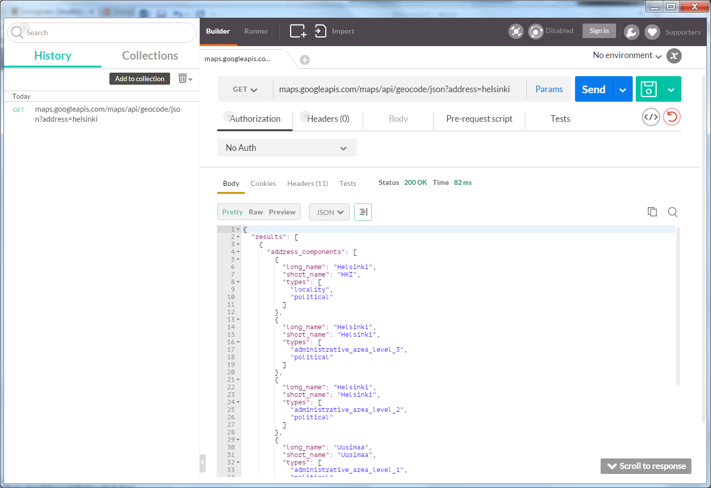
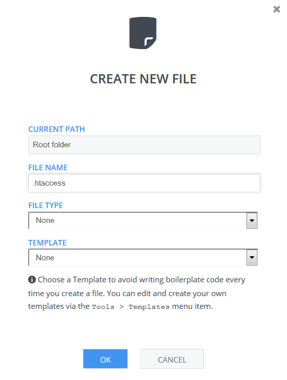

# RESTful APIs

In this lab you learn the basics of RESTful APIs. REST has become one of the most important technologies for Web applications.
Every major development language now includes frameworks for building RESTful Web services. 
Also CodeIgniter has also nowadays a RESTful server implementation. We will discuss this later on section 17.

REST stands for Representational State Transfer, which is an architectural style used to build Web services that are lightweight, maintainable, and scalable. 


## Task list

In the lab you do the following tasks:

1. Use existing published REST APIs
2. Write a mash-up combining existing REST API's results
3. Wtite your own REST API.

This lab takes approximately 2 hours.


## 1 REST architectural style

### Application as a resource provider

We can think of every system as a system using resources. These resources can be pictures, video files, 
Web pages, business information, or anything that can be represented in a computer-based system. 
The purpose of a service is to provide access to these resources. 

A RESTful service is stateless and does not maintain the application state for any client. 
A request cannot be dependent on a past request and a service treats each request independently. 
HTTP is itself a stateless protocol by design. 


### Requiring resources

REST requires each resource to have at least one URI. 
A RESTful service uses a directory hierarchy like human readable URIs to address its resources. 
The job of a URI is to identify a resource or a collection of resources. 
The actual operation is determined by an HTTP verb. The URI should not say anything about the operation or action. 
This enables us to call the same URI with different HTTP verbs to perform different operations.

Suppose we have a database of persons and we wish to expose it to the outer world through a service. 
A resource person can be addressed like this:

http://MyService/Persons/1

### HTTP methods used

You have seen GET and POST methods used, but a RESTful style is  to use all HTTP methods, and to use of them in
a consistent way.

Method |	Operation performed on server | Quality
| --------|---------|-------|
GET |	Read a resource. |	Safe
PUT |	Insert a new resource or update if the resource already exists. |	Idempotent
POST |	Insert a new resource. Also can be used to update an existing resource. |	N/A
DELETE	 | Delete a resource .	 | Idempotent
OPTIONS |	List the allowed operations on a resource.	 | Safe
HEAD |	Return only the response headers and no response body. |	Safe

A Safe operation is an operation that does not have any effect on the original value of the resource. 

An Idempotent operation is an operation that gives the same result no matter how many times you perform it.

An example of an HTTP request to put a new character in the Persons database.
POST http://MyService/Person/
Host: MyService
Content-Type: application/json
Accept: application/json
{
    "id": 1,
     "Name": "Harry Potter",
     "Email": "harry.potter@hogwarts.magic",
     "From": Book
}

## 2 REST API

API stands for Application Programming Interface - it means that we give access to public methods of an application outside of the program itself. 
To allow this action to take place, the application has to publish an API that specifically allows for 
foreign applications to make calls to its data and return data to the user from inside of the external application. 

On the web there are nowadays huge amount of services who have published an API for outside clients to use. 
The next figure is of an API Console where you can try different public REST APIs. As you can see the possible requests are described.

.

Another easy playground is Postman, a Crome browser plugin, where you also can write requests for public APIs. 
The next figure shows an example of using Google maps information on locations.

.

### Using REST APIs

Next we are using two REST APIs to build a mash-up. The example application can be found on the web.
We write simple web application which converts a location into latitude and longitude using the Google Maps API.
Then it uses those coordinates to pull images taken in that location from the Instagram API.

These kind of applications are called mashups, which refers to a web application, that uses content from more than one source to create a single 
new service displayed in a single graphical interface. 
Nowadays there are also Mashup composition tools that are usually simple enough to be used by end-users. 
They generally do not require programming skills and rather support visual wiring of GUI widgets, services and components together. 
We are using these two APIs to program a mashup with PHP. First the queries we are using are the ones we have in the above figures.
They are

'https://maps.googleapis.com/maps/api/geocode/json?address=helsinki, fi'

and

'https://api.instagram.com/v1/media/search?lat=60.1788737%lng=24.9570322'


But because we are making an application, we will allow the user to tell a location name, 
and make our program to find the coordinates, and use them to find out photos from Instagram.
```
<!DOCTYPE html>
<html lang="en">
  <head>
    <meta charset="utf-8"/>
    <title>geogram</title>
  </head>
  <body>
  <form action="/geogram.php" method="get">
    <input type="text" name="location"/>
    <button type="submit">Submit</button>
  </form>
    <br/>
    <?php
    if(!empty($instagram_array)){
      foreach($instagram_array['data'] as $key=>$image){
        echo '<br/>';
      }
    }
    ?>
  </body>
</html>
```
We will put everything in a single page, the above is our form with a little PHP code. In front of this we put our PHP code to make up the URIs. 
As you can see the file is called geogram.php.

```
<?php
if (!empty($_GET['location'])){
  /**
   * Here we build the url we'll be using to access the google maps api
   */
  $maps_url = 'https://'.
  'maps.googleapis.com/'.
  'maps/api/geocode/json'.
  '?address=' . urlencode($_GET['location']);
  $maps_json = file_get_contents($maps_url);
  $maps_array = json_decode($maps_json, true);
  $lat = $maps_array['results'][0]['geometry']['location']['lat'];
  $lng = $maps_array['results'][0]['geometry']['location']['lng'];
  /**
   * Time to make our Instagram api request. We'll build the url using the
   * coordinate values returned by the google maps api
   */
  $instagram_url = 'https://'.
    'api.instagram.com/v1/media/search' .
    '?lat=' . $lat .
    '&lng=' . $lng .
    '&client_id=CLIENT-ID'; //replace "CLIENT-ID"
  $instagram_json = file_get_contents($instagram_url);
  $instagram_array = json_decode($instagram_json, true);
}
?>
```

### Test your understanding

1. Make your own mash-up application using at least two existing public REST APIs.


###Making your own REST API

First give a simple name for API end point:

'https://www.YourApp.com/Api/'

so for resources it is:

'https://www.YourApp.com/Api/ResourceName'

Then you should design which resources you have, and requests you use for getting resources. 
Take a look at the HTTP methos table in the beginning of this section.

Next you should consider what are the error messages you give in different situations accessing the resources.

Once the API functionality and the corresponding URIs have been designed,
the next step is to map each URI to a PHP function that handles the corresponding action.

In Codio, the first step is to add a file called .htaccess into the root directory of the project’s workspace. 
You can simply right-click the project’s master folder icon in the project’s Codio workspace and select New File…:

.

The .htaccess file is used by Apache web server, and it may contain instructions for the web server to redirect URI requests.
Add the following contents to the newly created .htaccess file:

```
Options -MultiViews
RewriteEngine On
RewriteCond %{REQUEST_FILENAME} !-f
RewriteRule ^ index.php [QSA,L]
```

The file tells to map all URIs to a file called index.php. Thus, all API calls are now directed to a single handler file 
that will be constructed in such a way that it contains a handler function for each operation. (Technically, 
there could be separate handler files for various URIs, but in this example all API calls are handled by the same handler script. Modularity is achieved by assigning separate functions for different operations.)
Now, create a handler file index.php:

```
<?php

# URI parser functions
# --------------------

    function getResource() {
        # returns numerically indexed array of URI parts
        $resource_string = $_SERVER['REQUEST_URI'];
        if (strstr($resource_string, '?')) {
            $resource_string = substr($resource_string, 0, strpos($resource_string, '?'));
        }
        $resource = array();
        $resource = explode('/', $resource_string);
        array_shift($resource);   
        return $resource;
    }

    function getParameters() {
        # returns an associative array containing the parameters
        $resource = $_SERVER['REQUEST_URI'];
        $param_string = "";
        $param_array = array();
        if (strstr($resource, '?')) {
            # URI has parameters
            $param_string = substr($resource, strpos($resource, '?')+1);
            $parameters = explode('&', $param_string);                      
            foreach ($parameters as $single_parameter) {
                $param_name = substr($single_parameter, 0, strpos($single_parameter, '='));
                $param_value = substr($single_parameter, strpos($single_parameter, '=')+1);
                $param_array[$param_name] = $param_value;
            }
        }
        return $param_array;
    }

    function getMethod() {
        # returns a string containing the HTTP method
        $method = $_SERVER['REQUEST_METHOD'];
        return $method;
    }
 
# Handlers, one included as an example
# ------------------------------------

    function getPersonById($book_id) {
        # implements GET method for /api/persons/1 etc.
        echo "Called GET handler for persons, id=".$book_id;
    }


# Main
# ----

    $resource = getResource();
    $request_method = getMethod();
    $parameters = getParameters();

    # Uncomment to see the contents for debugging:
    # var_dump($resource);
    # var_dump($request_method);
    # var_dump($parameters);
 
    # Redirect to appropriate handler.
    # This is just an example:
    if ($request_method=="GET" && $resource[0]=="api" && $resource[1]=="persons") {
        $person_id = $resource[2];
        getPersonById($person_id);
    }
?>
```

The three functions in the beginning, getResource(), getParameters() and getMethod(), are URI parsing functions that return the information embedded in the URI in a consumable format.
For instance, suppose a GET request http://museum-austria.codio.io:3000/library/books/912?q=123&t=5 has been obtained by server.
- For this sample URI, function getResource() would produce a numerical array of URI parts, where element 0 contains the value “library”, and element 1 contains the value “books”. Likewise, the value of element 2 is 912.
- The second function, getParameters(), produces an associative array, where element “q” has value 123, and element “t” has a value of 5.
- Finally, function getPersonByID() returns a string containing the HTTP method, i.e. “GET”.

The URI parser functions can be left as they are. The interesting part is in the very end, where the different handler functions are called. In the example, GET requests with URI parts api/persons are directed to a function called getPersonById() that gets the person’s id as a parameter. The corresponding function, getPersonById(), is just a mockup implementation.
Thus, adding new functionality to the API is simple:

1.	write corresponding handler functions.
2.	expand the if statement in the end to call the newly-written handler functions.

### Test your understanding

1. Design your own small REST API using at least GET and PUT requests for listing and adding resources.

